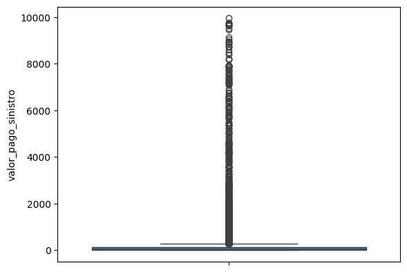
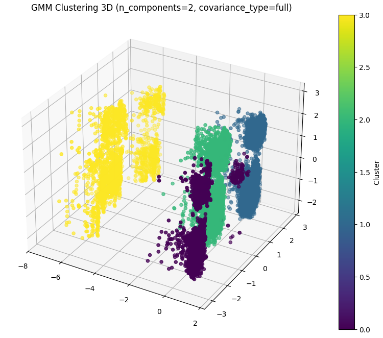

# Documentação Modelo Preditivo - Inteli

## ClusterCare
### Álcali
#### Enzo Salvador Barci, Felipe Freire Machado Simão, Leonardo Nigri Griner, Lucas Magalhães Castro Rodrigues, Marcelo Conde Filho, Mateus Beppler Pereira, Roberto Diniz Branco Filho

## Sumário
[1. Introdução](#c1)

[2. Objetivos e Justificativa](#c2)

[3. Metodologia](#c3)

[4. Desenvolvimento e Resultados](#c4)

[5. Conclusões e Recomendações](#c5)

[6. Referências](#c6)

[Anexos](#attachments)


## <a name="c1"></a>1. Introdução

&nbsp;&nbsp;&nbsp;&nbsp;Segundo o site da Unipar, a Unipar é uma empresa líder na produção de cloro e soda e a segunda maior produtora de PVC da América do Sul. Com operações no Brasil e na Argentina, a Unipar fornece matérias-primas para setores como saneamento, construção civil, têxtil, papel e celulose, alimentos e farmacêutica.[¹](#c6)

&nbsp;&nbsp;&nbsp;&nbsp;Hoje, a Unipar necessita de uma análise estruturada e preditiva dos dados de saúde dos colaboradores. Essa análise é necessária para criar programas de saúde personalizados e eficazes, atendendo às diversas necessidades dos colaboradores e melhorando suas iniciativas de saúde.

## <a name="c2"></a>2. Objetivos e Justificativa
### 2.1 Objetivos

&nbsp;&nbsp;&nbsp;&nbsp;Criar uma solução com um modelo preditivo para apoiar na avaliação dos dados de saúde dos colaboradores da Unipar, com base em comportamentos relacionados à utilização do plano de saúde. Além disso, a solução servirá como base para a criação de programas e planos de ação direcionados para cada público/necessidade.

### 2.2 Proposta de solução

&nbsp;&nbsp;&nbsp;&nbsp;A proposta de solução de modelo preditivo idealizada visa fornecer uma gestão mais eficiente da saúde dos colaboradores através de análises detalhadas e preditivas. Utilizando modelos que antecipam futuras demandas de saúde, a solução permite uma compreensão mais profunda do comportamento dos colaboradores e identifica rapidamente problemas emergentes, reduzindo os custos com sinistralidade. Ferramentas analíticas complementam essa abordagem, proporcionando relatórios e metrificação de conteúdos, facilitando a tomada de decisões informadas.

### 2.3 Justificativa

&nbsp;&nbsp;&nbsp;&nbsp;Nos dias de hoje, de acordo com a McKinsey Health Institute, a saúde e o bem-estar dos colaboradores são extremamente importantes para o sucesso organizacional, melhorando todas as métricas relacionadas ao resultado em que a empresa gera.[²](#c6) A Unipar reconhece a importância de desenvolver programas de saúde que não apenas atendam, mas também antecipem as necessidades de seus funcionários. A proposta de solução de modelo preditivo para a gestão da saúde dos colaboradores no Grupo Unipar representa uma abordagem inovadora e estratégica para o bem-estar corporativo e a eficiência operacional. Alguns pontos-chave que defendem o potencial e os benefícios são:

#### Potencial de Previsão e Proatividade:
&nbsp;&nbsp;&nbsp;&nbsp;Para atender às crescentes demandas por personalização e eficiência, a solução se concentrará no desenvolvimento de modelos preditivos avançados. Esses modelos permitirão antecipar o comportamento dos colaboradores em relação ao uso dos planos de saúde, proporcionando _insights_ valiosos que facilitarão a criação de programas de saúde altamente direcionados. Além disso, essa abordagem permitirá a realização de ajustes proativos, à medida que novas tendências de comportamento forem identificadas, garantindo que os programas de saúde permaneçam relevantes e eficazes ao longo do tempo.

#### Redução de Custos com Sinistralidade:
&nbsp;&nbsp;&nbsp;&nbsp;Ao implementar uma análise aprofundada do uso dos planos de saúde, a solução busca identificar e eliminar custos desnecessários, otimizando a alocação de recursos. Essa abordagem permitirá uma gestão mais eficiente, contribuindo para a redução dos gastos globais com sinistralidade, garantindo que os investimentos em saúde sejam direcionados de maneira mais estratégica e eficaz.

#### Diferenciais Competitivos:
&nbsp;&nbsp;&nbsp;&nbsp;A adoção de uma abordagem preditiva coloca a Unipar em uma posição de destaque no mercado, ao permitir uma gestão de saúde altamente baseada em evidências e proatividade. Essa estratégia eleva o padrão de cuidados oferecidos aos colaboradores, ao mesmo tempo em que fortalece a imagem da empresa como uma líder em inovação e comprometida com o bem-estar de sua equipe. Essa vantagem competitiva não só atrai e retém talentos, mas também solidifica a reputação da Unipar como uma organização pioneira em soluções de saúde empresarial.

## <a name="c3"></a>3. Metodologia
&nbsp;&nbsp;&nbsp;&nbsp;De acordo com site Data Science a metodologia CRISP-DM (Cross-Industry Standard Process for Data Mining) é uma abordagem amplamente utilizada para guiar projetos de análise e ciência de dados. Ela é composta por seis fases principais: entendimento do negócio, entendimento dos dados, preparação dos dados, modelagem, avaliação e implantação. Essas fases são interativas e flexíveis, permitindo que as equipes de projeto voltem a etapas anteriores conforme necessário para melhorar os resultados. A metodologia é popular porque oferece um framework robusto e adaptável para transformar dados brutos em insights e hipóteses, independentemente do setor ou aplicação.[³](#c6)

<div align="center">
<sub>Figura 1 — CRISP-DM <a href="#c6"></a></sub> </br>
<br>
<sup>CRISP-DM. Fonte: Chapman, Pete, et al.</sup>
</div><br>

[Link para Leitura](https://miro.medium.com/v2/resize:fit:854/format:webp/1*-taUKGZIfeOnzhMPqVLvtQ.png)

&nbsp;&nbsp;&nbsp;&nbsp;Entendimento do Negócio: Este passo é importante para alinhar os objetivos do projeto de ciência de dados com os objetivos do negócio. Ele envolve a definição clara do problema que se pretende resolver, a compreensão das necessidades da empresa e a definição das métricas de sucesso, garantindo que o modelo de dados criado traga valor real para a organização.

&nbsp;&nbsp;&nbsp;&nbsp;Entendimento dos Dados: Nesta fase, os dados são coletados e explorados para obter insights iniciais. A qualidade e a relevância dos dados são avaliadas através de estatísticas descritivas e visualizações. Este passo também envolve a identificação de problemas como valores ausentes ou inconsistentes, que podem impactar o sucesso do projeto.

&nbsp;&nbsp;&nbsp;&nbsp;Preparação dos Dados: Esta etapa envolve a limpeza, transformação e formatação dos dados para garantir que estejam prontos para a modelagem. A preparação dos dados é frequentemente a fase mais longa, exigindo que os dados sejam ajustados e estruturados conforme as necessidades específicas do modelo de machine learning.

&nbsp;&nbsp;&nbsp;&nbsp;Modelagem: Aqui, diferentes algoritmos de machine learning são aplicados aos dados preparados para construir modelos preditivos. Esta fase inclui a escolha do algoritmo mais adequado, o ajuste de parâmetros e a validação do modelo para garantir sua precisão. Diversos modelos podem ser testados para identificar o mais eficiente.

&nbsp;&nbsp;&nbsp;&nbsp;Avaliação: A avaliação do modelo é fundamental para garantir que ele atenda aos objetivos do negócio. Nesta fase, o desempenho do modelo é comparado com as métricas de sucesso definidas anteriormente. Se o modelo não satisfizer os critérios do negócio, pode ser necessário revisitar etapas anteriores para melhorar os resultados.

&nbsp;&nbsp;&nbsp;&nbsp;Implementação: A última etapa envolve a implementação do modelo em um ambiente de produção, onde ele pode ser utilizado para fazer previsões em tempo real ou fornecer insights. A implementação pode incluir a criação de dashboards ou a integração do modelo com sistemas existentes, garantindo que os resultados sejam acessíveis e acionáveis.

&nbsp;&nbsp;&nbsp;&nbsp;Concluindo, o CRISP-DM é uma metodologia estruturada que orienta projetos de ciência de dados desde o entendimento inicial do negócio até a implementação do modelo. Com seus seis temas – Entendimento do Negócio, Entendimento dos Dados, Preparação dos Dados, Modelagem, Avaliação e Implementação – oferece um framework claro e eficiente. Essa abordagem garante que os objetivos empresariais sejam alinhados com as análises de dados, assegurando a qualidade e relevância das informações utilizadas. Ao seguir o CRISP-DM, as equipes de data science podem aumentar a eficácia dos projetos, minimizar riscos e gerar soluções que realmente agregam valor às organizações.


## <a name="c4"></a>4. Desenvolvimento e Resultados
### 4.1. Compreensão do Problema
#### 4.1.1. Contexto da indústria 

### Contextualização da Indústria Química
&nbsp;&nbsp;&nbsp;&nbsp; A indústria química serve a diversas cadeias produtivas, fornecendo matérias-primas para setores como construção civil, têxtil, papel e celulose, desinfetantes, alimentos, bebidas, farmacêutica e muitos outros. Empresas como a Unipar desempenham um papel vital, sendo líderes na produção de cloro, soda e PVC na América do Sul. A sustentabilidade e a inovação são tendências crescentes, com um foco significativo em soluções que atendam às necessidades de saúde e segurança dos colaboradores e consumidores.

&nbsp;&nbsp;&nbsp;&nbsp;Dentro dessa indústria, os maiores _players_ que concorrem com a Unipar são "Dow Chemical Company", "BASF" e "LyondellBasell Industries":</br>
&nbsp;&nbsp;&nbsp;&nbsp;A Dow Chemical Company tem como modelo de negócio a produção e distribuição global de produtos químicos, plásticos e agrícolas. Além de ter foco em sustentabilidade, com iniciativas para reduzir emissões de carbono e aumentar a eficiência energética. A BASF (Badische Anilin & Sodafabrik Aktiengesellschaft) tem um amplo portfólio, incluindo produtos químicos, plásticos, materiais de desempenho, produtos agrícolas e óleo e gás. Com foco na inovação, investe em pesquisa e desenvolvimento para soluções químicas sustentáveis. Por fim, a LyondellBasell Industries possui uma produção de produtos químicos, plásticos e refinamento, e seu diferencial é a sustentabilidade, com programas focados em reciclagem e redução de desperdício plástico.

&nbsp;&nbsp;&nbsp;&nbsp;As tendências na indústria química, com o uso de inteligência artificial em modelos preditivos, são positivas, devido à sua capacidade de fornecer _insights_ valiosos e melhorar a eficiência operacional. A utilização de inteligência artificial e machine learning permite analisar grandes volumes de dados para prever tendências e otimizar processos. A análise de _big data_ auxilia na coleta e análise de dados para identificar padrões e personalizar soluções para clientes. A Internet das Coisas (IoT) contribui com dispositivos conectados que coletam dados em tempo real, possibilitando o monitoramento contínuo de processos e equipamentos. Além disso, a modelagem e simulação são ferramentas essenciais para prever o desempenho e otimizar operações, enquanto o aprendizado contínuo permite a adaptação rápida a mudanças no mercado e nas operações internas.


&nbsp;&nbsp;&nbsp;&nbsp;Segundo a autora Camila Casarotto, as 5 forças de Porter é um _framework_ para análise setorial que possibilita entendermos o nível de competitividade do mercado, relacionando os atores e forças de um mercado. Este _framework_ se divide em 5 forças, ameaça de novos entrantes, sendo uma força que estuda a facilidade de novos entrantes ao mercado, ameaça de produtos substitutos, buscando entender a disponibilidade de produtos e serviços substitutos no mercado, poder de barganha dos fornecedores, estuda a influência que os fornecedores possuem sobre o preço e a qualidade dos produtos, poder de barganha dos compradores, estuda a influência que os clientes possuem sobre o preço e a qualidade dos produtos e rivalidade entre concorrentes, estuda o grau de competição entre as empresas já estabelecidas no mercado.[⁴](#c6)

<div align="center">
<sub>Figura 2 — 5 Forças de Porter</sub> </br>
<br>
<sup>Fonte: Material produzido pelos autores (2024).</sup>
</div><br>

[Link para Leitura](https://www.figma.com/design/uzKYLoBiz7WCJJIb6xIfpz/5-For%C3%A7as-de-Porter?node-id=0-1&t=ji6a2nzrwkjtwadH-1)

&nbsp;&nbsp;&nbsp;&nbsp;**Ameaça de novos entrantes (Baixo):** A ameaça de novos entrantes refere-se ao risco de que novas empresas entrem no mercado, aumentando a competição. No contexto da indústria química, essa ameaça é considerada baixa, pois as barreiras de entrada são significativas, essas barreiras incluem altos custos iniciais para estabelecer operações, a necessidade de cumprir regulamentos ambientais rigorosos e a demanda por conhecimento técnico especializado. Essas dificuldades tornam difícil para novas empresas entrarem e competirem com as já estabelecidas no mercado.

&nbsp;&nbsp;&nbsp;&nbsp;**Ameaça de produtos substitutos (Médio):** A ameaça de produtos substitutos é o risco de que produtos ou serviços alternativos substituam os atuais. Na indústria química, essa ameaça é moderada. A inovação tecnológica tem gerado alternativas a produtos químicos tradicionais, como compostos biodegradáveis ou soluções sustentáveis.

&nbsp;&nbsp;&nbsp;&nbsp;**Poder de barganha dos fornecedores (Alto):** O poder de barganha dos fornecedores refere-se à capacidade dos fornecedores de influenciar os preços e as condições de fornecimento. Na indústria química, os fornecedores exercem um poder significativo, pois muitos insumos são altamente especializados e difíceis de substituir. Isso lhes dá a capacidade de impor preços elevados e condições rigorosas, afetando diretamente os custos operacionais das empresas químicas.

&nbsp;&nbsp;&nbsp;&nbsp;**Poder de barganha dos compradores (Médio):** O poder de barganha dos compradores é a capacidade dos clientes de influenciar as condições comerciais, como preço e qualidade. No contexto da indústria química, esse poder é médio. A grande concorrência no setor proporciona aos compradores várias opções de fornecedores, permitindo que negociem melhores condições. No entanto, a complexidade e a especialização de muitos produtos químicos limitam a influência dos compradores.

&nbsp;&nbsp;&nbsp;&nbsp;**Rivalidade entre os Concorrentes (Alto):** A rivalidade entre os concorrentes diz respeito à intensidade da competição entre as empresas já estabelecidas no mercado. Na indústria química, essa rivalidade é alta, com muitas empresas lutando por uma fatia do mercado. Isso leva a uma constante busca por inovação, melhorias na eficiência operacional e diferenciação dos produtos.

&nbsp;&nbsp;&nbsp;&nbsp;Esta análise é muito importante para entendermos a dinâmica competitiva que influencia a posição da Unipar no mercado. Identificar essas forças permite à empresa identificar suas principais forças e fraquezas, a fim de compreendermos como é possível melhorar a eficiência operacional da empresa.

#### 4.1.2. Análise SWOT 

&nbsp;&nbsp;&nbsp;&nbsp;Segundo publicação da redatora Camila Casarotto no site RockContent, pode-se chegar à conclusão de que a análise SWOT é uma ferramenta de  gestão que se baseia no estudo de certas características de uma empresa,  produto ou projeto. Essas propriedades são: **forças e fraquezas**  (internas da instituição), e **oportunidades e ameaças** (externas à  instituição). Por exemplo, identificar forças como uma equipe talentosa,  fraquezas como processos ineficientes, oportunidades como novos  mercados e ameaças como concorrentes agressivos. Essa análise ajuda na  tomada de **decisões estratégicas** e a entender o posicionamento e  potencial de uma organização. Na tabela a seguir, depara-se com a  análise SWOT do Grupo Unipar realizada pelo nosso grupo.[⁵](#c6)

<div align="center">
<sub>Figura 3 — Análise SWOT</sub> </br>
<br>
<sup>Fonte: Material produzido pelos autores (2024).</sup>
</div><br>

[Link para Leitura](https://miro.com/app/board/uXjVKsOOoZM=/)

#### Forças (Strengths)

&nbsp;&nbsp;&nbsp;&nbsp;**Posicionamento de Mercado e Reconhecimento de Marca:** O Grupo Unipar é bem estabelecido no setor de produtos químicos e petroquímicos, com uma história robusta e uma forte presença no mercado brasileiro e internacional.
**Diversificação de Produtos:** A empresa oferece uma ampla gama de produtos químicos, incluindo cloro, soda cáustica, e derivados, que são essenciais em várias indústrias, garantindo uma demanda constante.
**Capacidade de Inovação:** Unipar é reconhecida por sua capacidade de inovação, mantendo-se na vanguarda do desenvolvimento de novos produtos e tecnologias no setor petroquímico.

#### Fraquezas (Weaknesses)

&nbsp;&nbsp;&nbsp;&nbsp;**Alta Rotatividade de Funcionários:** A empresa enfrenta desafios com a alta rotatividade de funcionários, o que pode levar a custos elevados com salários para manter talentos.
**Pressão sobre Margens de Lucro:** As margens de lucro e operacionais poderiam ser melhoradas, o que pode pressionar as finanças da empresa no futuro.
**Dependência de Expertise Específica:** Poucos funcionários são responsáveis por uma grande parte do conhecimento técnico da empresa, o que torna difícil substituí-los.

#### Oportunidades (Opportunities)

&nbsp;&nbsp;&nbsp;&nbsp;**Expansão Econômica:** Com a economia dos EUA crescendo rapidamente, há oportunidades para a Unipar expandir sua presença no mercado norte-americano.
**Preferências do Cliente:** Com rendas disponíveis aumentando e fácil acesso à informação, os clientes estão mais dispostos a experimentar novos produtos, proporcionando uma oportunidade para a Unipar introduzir ofertas inovadoras.
**Espaço Online:** A adoção crescente de serviços online oferece uma nova avenida para a Unipar expandir suas vendas e operações.

#### Ameaças (Threats)

**Desconfiança Institucional e Ações Legais:** Dificuldades em aplicar regulamentos e leis da OMC podem resultar em processos legais caros e prolongados, afetando o investimento em mercados emergentes.
**Comoditização do Segmento de Produtos:** A crescente comoditização no setor de materiais básicos é uma grande ameaça, desafiando a Unipar a se diferenciar no mercado.

#### Conclusão

&nbsp;&nbsp;&nbsp;&nbsp;O Grupo Unipar mostra-se bem estabelecido no mercado de produtos químicos e petroquímicos, com forte capacidade de inovação. Contudo, enfrenta desafios internos, principalmente na gestão de talentos e pressões sobre margens de lucro. Oportunidades de expansão para o mercado norte-americano e no comércio online são promissoras, mas a empresa deve ficar atenta à crescente concorrência e comoditização do mercado.
Para prosperar, a Unipar deve focar em:
Reduzir a rotatividade de funcionários e reter conhecimento técnico.
Investir em inovação contínua.
Explorar a expansão no mercado norte-americano e online.
Melhorar margens de lucro através de eficiências operacionais.
Fortalecer a conformidade regulatória para mitigar riscos legais.
Abordando suas fraquezas e aproveitando suas forças e oportunidades, a Unipar pode alcançar crescimento sustentável e manter sua liderança no setor, apesar das ameaças do mercado em evolução.

#### 4.1.3. Planejamento Geral da Solução

a) quais os dados disponíveis (fonte e conteúdo - exemplo: dados da área de Compras da empresa descrevendo seus fornecedores).

b) qual a solução proposta (pode ser um resumo do texto da Seção 2.2).

c) qual o tipo de tarefa (regressão ou classificação).

d) como a solução proposta deverá ser utilizada.

e) quais os benefícios trazidos pela solução proposta.

f) qual será o critério de sucesso e qual métrica será utilizada para avaliá-lo.

#### Respostas

a) Dados da área de sinistro da UNIPAR, fornecendo as descrições dos prestadores junto com todas as outras informações do sinistro.

b) Modelo preditivo idealizada visa fornecer uma gestão mais eficiente da saúde dos colaboradores através de análises detalhadas e preditivas

c) Atualmente, estamos na sprint 1, e, por isso, ainda não conseguimos determinar definitivamente qual será o tipo de tarefa que utilizaremos para manipular os dados fornecidos pelo parceiro. Entretanto, acreditamos que a abordagem mais adequada, neste momento, é utilizar aprendizagem não supervisionada, por meio de agrupamento de dados. Dessa forma, será possível identificar características semelhantes nos dados, visando encontrar padrões que permitam uma classificação mais segmentada. Por conta disso, as informações na base de dados não serão rotuladas, o que permitirá à máquina ter _insights_ e identificar padrões ainda não explorados.

d) Deverá ser utilizada de forma integrada e contínua para maximizar os benefícios aos colaboradores, tendo as etapas: integração de dados, análise e previsão, ação baseada em _insights_, capacitação dos usuários e por último monitoramento e avaliação do resultado.

e) Redução dos custos com sinistralidade, junto com a melhor compreensão do comportamento de saúde dos colaboradores.

f) Alguns dos critérios de sucesso para a avaliação, serão redução de custos de sinistralidade, melhoria na saúde dos colaboradores, aumento da eficiência dos programas de saúde e por último a conformidade e segurança de dados. Tendo como métricas de avaliação a redução do percentual de custos totais do plano de saúde, diminuição da frequência de utilização do plano de saúde para condições preveníveis, avaliação de satisfação dos colaboradores com os programas de saúde e a taxa de adoção da plataforma pelos gestores de RH e saúde.


#### 4.1.4. Value Proposition Canvas

&nbsp;&nbsp;&nbsp;&nbsp;De acordo com uma descrição fornecida por Kellison Ferreira, que é redator no [blog Vera](https://blog.somostera.com/product-management/canvas-de-proposta-de-valor), o Quadro de Proposta de Valor é uma ferramenta estratégica essencial que alinha os problemas enfrentados pelos clientes às soluções oferecidas pela empresa. No primeiro segmento, chamado **Proposta de Valor**, são listados os benefícios e os diferenciais que a empresa oferece aos seus clientes. No segundo segmento, Segmento do Cliente, são destacadas as necessidades do cliente, suas principais **dificuldades**, os **benefícios** esperados e os **valores** que consideram importantes. Essa ferramenta é fundamental para ajudar as empresas a sincronizarem suas ofertas com as exigências dos clientes. [⁶](#c6)

<div align="center">
<sub>Figura 4 - Value Proposition Canvas</sub>
</div>
<br>
<div align="center">
<sub>Fonte: Material produzido pelos autores (2024)</sub>
</div>

[Link para Leitura](https://drive.google.com/file/d/1z6o90C4oTYD0SjpptW2GXLkBgetV1ZD-/view?usp=sharing)

&nbsp;&nbsp;&nbsp;&nbsp;Após a avaliação da proposta de valor para o Grupo Unipar, foi identificado que para aliviar a dor dos altos custos associados à utilização dos planos de saúde, seria eficaz reduzir esses custos através da prevenção e gestão proativa da saúde. Foi percebido também que a falta de dados estruturados para análise e previsão é uma das grandes dificuldades enfrentadas pela empresa. Por isso, fornecer análises detalhadas e previsões confiáveis sobre a utilização dos planos de saúde é essencial para diminuir essa dor. As tarefas do cliente abordadas incluem: gerenciar eficazmente a saúde dos colaboradores e implementar programas de saúde que preveem e mitigam riscos futuros.

&nbsp;&nbsp;&nbsp;&nbsp;Com isso, decidiu-se oferecer uma plataforma analítica que integra modelagem preditiva e análises de tendências de saúde. Outro ponto importante relatado no Canvas é a seção de ganhos que o cliente receberá, como a redução de custos com planos de saúde através de uma gestão mais eficiente e a melhoria no bem-estar dos colaboradores, evitando o agravamento de condições de saúde, o que por sua vez reduz a utilização desnecessária do plano de saúde e seus custos associados.

&nbsp;&nbsp;&nbsp;&nbsp;Também foram listados os criadores desses ganhos, como o acesso a relatórios detalhados e dashboards interativos que proporcionam _insights_ valiosos para uma tomada de decisão informada, junto com a melhoria da saúde corporativa e a redução da incidência e gravidade de problemas de saúde entre os colaboradores. Isso aumenta a eficiência operacional e promove uma força de trabalho mais saudável e produtiva.

&nbsp;&nbsp;&nbsp;&nbsp;Conclui-se, portanto, que a Proposta de Valor (Canvas) tem papel fundamental para relatar os problemas que o cliente possui, junto com as soluções que a empresa irá oferecer.

#### 4.1.5. Matriz de Riscos

&nbsp;&nbsp;&nbsp;&nbsp;De acordo com a redatora Bianca Minetto a matriz de risco e oportunidade é uma ferramenta de fundamental importância para o gerenciamento da estratégia do projeto, permitindo o preparo da equipe diante a possíveis riscos e oportunidades. Essa análise é fundamental para antecipar desafios e aproveitar potenciais vantagens em ambientes competitivos. A matriz é desenvolvida através de uma **metodologia rigorosa**, que leva em consideração variáveis internas e externas, fornecendo uma visão compreensiva que ajuda na tomada de decisão de forma mais consciente e planejada. [⁷](#c6)

<div align="center">
<sub>Figura 5 — Matriz de Risco</sub> </br>
<br>
<sup>Fonte: Material produzido pelos autores (2024).</sup>
</div><br>

[Link para Leitura](https://www.figma.com/design/01S3kLEcKp24ReF5akWbnW/Matriz-de-Risco-UNIPAR)

&nbsp;&nbsp;&nbsp;&nbsp;Com o desenvolvimento da matriz de risco e oportunidade, é possível traçar alguns planos de ação a fim de mitigar e planejar. A seguir, apresentamos os planos de ação desenhados para cada um dos riscos.

### Planos de Ação contra Ameaças

* **Dificuldade em criar e interpretar um modelo preditivo robusto e preciso**
  * Probabilidade: 70%
  * Impacto: Alto
  * Ação: Estudar bastante o assunto, e trabalhar corretamente junto com o grupo a fim de conseguir fazer uma entrega satisfatória. Promover sessões de revisão por pares para identificar e corrigir possíveis falhas no modelo antes da entrega final. Implementar um processo de iteração contínua para refinar o modelo com base no feedback e nos dados reais obtidos.

* **Dados incompletos ou incorretos comprometendo a precisão do modelo preditivo**
  * Probabilidade: 50%
  * Impacto: Muito alto
  * Ação: Estabelecer uma política rigorosa de limpeza e validação de dados, incluindo a implementação de verificações automatizadas que identifiquem e corrijam inconsistências. Utilizar técnicas de imputação de dados e análise estatística para lidar com valores ausentes ou anômalos. Trabalhar em conjunto com os fornecedores de dados para melhorar a qualidade dos dados na origem.

* **Exposição de dados sensíveis, gerando problemas legais**
  * Probabilidade: 10%%
  * Impacto: Muito alto
  * Ação: Desenvolver e implementar políticas de anonimização e criptografia de dados em conformidade com as legislações locais e internacionais, como a LGPD. Treinar a equipe em melhores práticas de proteção de dados e conscientização sobre a importância da privacidade.

* **Resistência dos colaboradores em compartilhar dados**
  * Probabilidade: 30%
  * Impacto: Alto
  * Ação: Implementar um plano de comunicação eficaz que inclua sessões informativas, onde os benefícios do projeto são claramente explicados, e esclarecer como os dados serão usados de forma ética e segura.

* **Necessidade contínua de atualização e manutenção do modelo**
  * Probabilidade: 50%
  * Impacto: Baixo
  * Ação: Propor à UNIPAR a criação de um cronograma de manutenção contínua, garantindo que o modelo seja revisado e atualizado regularmente para se manter relevante e preciso. Documentar extensivamente o código e os processos, facilitando futuras atualizações por parte de outros especialistas. Implementar práticas de codificação que promovam a modularidade e a reutilização, permitindo que componentes do modelo sejam facilmente ajustados sem comprometer o sistema como um todo.

&nbsp;&nbsp;&nbsp;&nbsp;A matriz de risco e oportunidade destacou oportunidades significativas para inovação e crescimento. Essas possibilidades emergem de uma análise detalhada do ambiente interno e externo, sugerindo estratégias para melhorar a competitividade e a eficiência operacional. A exploração dessas oportunidades é vital para adaptar-se e prosperar em mercados dinâmicos.

### Exploração de Oportunidades
* **Melhoria da Saúde dos Colaboradores**
  * Probabilidade: 90%
  * Impacto: Muito alto
  * Ação: Utilizar os *insights* gerados pelo modelo preditivo para desenvolver programas de saúde personalizados, focados nas necessidades específicas dos colaboradores, identificando tendências de risco e intervindo proativamente. Medir regularmente os resultados desses programas e ajustá-los para maximizar o impacto na saúde dos colaboradores.


* **Redução de Custos de Saúde com esse novo projeto**
  * Probabilidade: 70%
  * Impacto: Alto
  * Ação: Realizar análises periódicas dos dados para identificar áreas onde os custos podem ser reduzidos sem comprometer a qualidade do atendimento à saúde. Explorar alternativas de tratamento preventivo que possam diminuir a necessidade de intervenções médicas mais caras. Utilizar os modelos preditivos para otimizar a alocação de recursos, evitando desperdícios.


* **Melhoria na Inovação e Competitividade**
  * Probabilidade: 50%
  * Impacto: Moderado
  * Ação: Integrar programas de saúde baseados em dados com as estratégias de inovação da empresa, posicionando a UNIPAR como líder em bem-estar corporativo.


* **Destacar-se como um empregador que se preocupa com a saúde de seus colaboradores**
  * Probabilidade: 50%
  * Impacto: Alto
  * Ação: Comunicar amplamente os esforços de saúde, tanto internamente quanto externamente, destacando o compromisso da UNIPAR com o bem-estar de seus colaboradores. Criar campanhas de marketing que reforcem essa imagem, utilizando depoimentos de colaboradores e resultados positivos dos programas de saúde para construir uma narrativa convincente.


* **Se o projeto for um sucesso, possibilidade de expandir para as operações na Argentina**
  * Probabilidade: 50%
  * Impacto: Muito alto
  * Ação: Iniciar um estudo de viabilidade detalhado para adaptar e expandir o modelo para as operações na Argentina. Considerar as diferenças culturais, econômicas e regulatórias ao planejar essa expansão, garantindo que o modelo possa ser ajustado para maximizar seu impacto no novo contexto.

&nbsp;&nbsp;&nbsp;&nbsp;Essas ações ajudam a mitigar as ameaças e a explorar as oportunidades de forma estruturada e eficiente, aumentando as chances de sucesso do projeto para a Unipar.

#### 4.1.6. Personas

&nbsp;&nbsp;&nbsp;&nbsp;Segundo a escritora Maria Luísa Andrade, uma proto-persona é uma descrição dos usuários com base nas suposições da própria equipe sobre quem é seu público alvo. Ao contrário da persona que é baseada em dados reais e não fictícios. Ela ajuda empresas e profissionais a entenderem melhor o comportamento, as necessidades e os objetivos do seu público-alvo, permitindo que as estratégias de _marketing_ e comunicação sejam mais direcionadas e proporcionem um maior retorno sobre investimento. Ao definir proto-persona, as organizações podem criar produtos, serviços e conteúdos que se alinham melhor com as expectativas de uso do produto, melhorando a experiência do usuário e os resultados obtidos.[⁸](#c6)

&nbsp;&nbsp;&nbsp;&nbsp;De acordo com a Rock Content, o conceito de _stakeholder_ foi criado na década de 1980, por Robert Edward Freeman, um filósofo norte-americano. O _stakeholder_ é qualquer indivíduo ou organização que é impactado pelas ações de uma empresa. Ou seja, se você possui conta em um banco, você é um _stakeholder_ desse banco.[⁹](#c6)

&nbsp;&nbsp;&nbsp;&nbsp;É importante saber que existem vários tipos de _stakeholder_, e para a persona, citamos três. O _stakeholder_ primário, secundário e afetado. Os primários são aqueles que exercem influência direta sobre a sua empresa. Os secundários já são impactados, influenciam e têm uma relação direta com a empresa. E para finalizar, o _stakeholder_ afetado é uma pessoa ou grupo que sofre impacto direto ou indireto pelas decisões, ações ou operações de uma empresa.[⁹](#c6)

&nbsp;&nbsp;&nbsp;&nbsp;Nosso projeto, que envolve a criação de um modelo preditivo para análise de dados fornecendo insights valiosos para ajudar na tomada de decisões em relação a programas de saúde dentro da unipar dados de saúde dos colaboradores, foca em três personas principais: RH, colaborador e analista de dados. O RH representa o colaborador da Gestão de Recursos Humanos da Unipar, responsável por implementar políticas de saúde e analisar dados relacionados ao plano de saúde. O colaborador é o funcionário que atua na área de produção da fábrica. Já o analista de dados, analisa os dados para ajudar em uma tomada de decisões mais eficiente. Cada uma dessas personas desempenha um papel na estruturação e personalização de programas de saúde da empresa.

<br>

<div align="center">
<sub>Figura 6 — Persona RH</sub> </br>
<br>
<sup>Fonte: Material produzido pelos autores (2024).</sup>
</div><br>

[Link para Leitura](https://drive.google.com/file/d/1Pq5OTgOC3xi4t3mHWu4plIOthAD3FZat/view?usp=sharing)

&nbsp;&nbsp;&nbsp;&nbsp;Desenvolvemos o Geraldo para ser o nosso gerente de RH como _stakeholder_ principal do projeto, pensamos em colocá-lo nessa posição pois o nosso foco diante esse módulo é trazer insights para o pessoal da área de RH da Unipar, para que possam tratar da melhor forma a situação. Nascido e criado em Cubatão, Geraldo sempre teve um forte vínculo com a cidade e com a comunidade local. Iniciou sua carreira em RH logo após a faculdade e encontrou no Grupo UNIPAR uma oportunidade de crescimento e estabilidade. Ao longo dos seis anos na empresa, Geraldo passou por várias funções, ganhando uma visão abrangente das operações de RH. Agora está no processo da criação de um projeto que visa melhorar a saúde geral dos colaboradores da empresa.

<br>

<div align="center">
<sub>Figura 7 — Persona Colaborador</sub> </br>
<br>
<sup>Fonte: Material produzido pelos autores (2024).</sup>
</div><br>

[Link para Leitura](https://drive.google.com/file/d/14LjP_aZODV6QnBRssA8skCX_7u9LXuoJ/view?usp=sharing)

&nbsp;&nbsp;&nbsp;&nbsp;Rogério Machado, caldeireiro experiente na Unipar, é um colaborador diretamente impactado pela solução desenvolvida neste projeto. Atuando na linha de frente em atividades de alto risco, como o manuseio de produtos químicos, sua segurança e bem-estar no ambiente de trabalho são fundamentais para seu desempenho e qualidade de vida.

&nbsp;&nbsp;&nbsp;&nbsp;Para que a solução proposta tenha um impacto positivo em sua vida, é fundamental que ela ofereça insights e resultados precisos sobre planos de saúde que atendam às suas necessidades específicas. Um plano de saúde personalizado permitirá que Rogério exerça suas funções com maior tranquilidade, confiando nas medidas de proteção implementadas pelo RH da Unipar. Dessa forma, ele poderá focar no seu trabalho sem preocupações excessivas com sua saúde.

&nbsp;&nbsp;&nbsp;&nbsp;Além de promover o bem-estar físico e emocional, essas mudanças contribuirão para o crescimento profissional de Rogério, criando um ambiente de trabalho mais seguro e saudável, no qual ele poderá se desenvolver com confiança.

&nbsp;&nbsp;&nbsp;&nbsp;Como desenvolvedores do projeto, nossa prioridade é criar um modelo capaz de processar dados de maneira eficiente, proporcionando análises precisas e confiáveis. Nosso objetivo é gerar previsões com o mais alto nível de exatidão, oferecendo insights que auxiliam os profissionais de RH a tomar decisões informadas.

&nbsp;&nbsp;&nbsp;&nbsp;É essencial evitar distorções ou erros que possam levar à adoção de planos de saúde inadequados. A solução precisa atender de forma realista às necessidades dos colaboradores. Além disso, garantimos a anonimização das informações sensíveis, assegurando um modelo seguro para todos que têm seus dados coletados.
<br>

<div align="center">
<sub>Figura 8 — Persona Analista de Dados</sub> </br>
<br>
<sup>Fonte: Material produzido pelos autores (2024).</sup>
</div><br>

[Link para Leitura](https://drive.google.com/file/d/1nTmmui672bG66qx7IrjowgTOUgO63tOn/view?usp=share_link)

&nbsp;&nbsp;&nbsp;&nbsp;Priscila Simão é uma analista de dados experiente e apaixonada por tecnologia, com uma sólida formação em Estatística. Nascida e criada em Cubatão, ela desenvolveu uma carreira diversificada, atuando em empresas de diferentes tamanhos, onde se destacou pela capacidade de transformar grandes volumes de dados em insights estratégicos. Aos 38 anos, ela enfrenta desafios como a integração de diversas fontes de dados, a visualização de informações complexas para públicos não técnicos e a necessidade constante de atualização tecnológica.

&nbsp;&nbsp;&nbsp;&nbsp;Dentro do projeto de transformação digital da Unipar, Priscila atua como uma _stakeholder_ secundária, ela desempenha um papel de muita importância no suporte à tomada de novas decisões e na implementação de tecnologias para a análise de dados. Com toda a experiência conquistada ao longo dos anos, Priscila é capaz de garantir que os dados utilizados sejam precisos e que os processos de análise sejam otimizados, o que aumenta a eficiência e competitividade da empresa.

<br>

&nbsp;&nbsp;&nbsp;&nbsp;Compreender as personas vai além de ser uma etapa do desenvolvimento de um projeto; é essencial para criar uma conexão genuína com a Unipar. Ao analisar dados e pesquisas, não estamos apenas coletando informações, mas traçando um caminho que nos aproxima das reais necessidades e desejos da Unipar. A criação dessas personas nos proporciona um entendimento mais profundo de quem utilizará nosso modelo preditivo e quem será diretamente impactado por ele. Dessa forma, podemos gerar análises e insights relevantes para o gerente de RH, com um foco claro em oferecer soluções personalizadas para cada tipo de colaborador. Isso nos permite entregar planos de saúde e estratégias de sinistralidade que realmente atendam às necessidades dos colaboradores, ao mesmo tempo em que auxiliamos o RH da Unipar a reduzir custos de forma eficiente.

### 4.1.7. Jornada do Usuário

&nbsp;&nbsp;&nbsp;&nbsp;De acordo com o artigo publicado pela Aela Contents, a Jornada do Usuário é uma ferramenta estratégica de extrema importância para um projeto, mapeando as etapas e interações que os colaboradores têm com os processos e sistemas da empresa. Ela captura as experiências, expectativas e desafios em cada ponto de contato, permitindo identificar áreas de melhoria e inovação. Ao mapear essa jornada, conseguimos ver as etapas que eles passam, as dificuldades que encontram e o que esperam dessas interações. Isso nos mostra onde podemos melhorar e trazer inovações.[¹⁰](#c6)

&nbsp;&nbsp;&nbsp;&nbsp;No nosso projeto, usamos a jornada de usuário para identificar como as pessoas realmente se sentem e o que elas precisam ao longo dessas etapas do nosso sistema. Isso ajuda a alinhar os processos com as necessidades dos colaboradores, tornando o sistema mais eficiente.Essa utilização não é apenas uma outra etapa, mas uma analize necessaria para que possamos entender como essas interações influenciam o dia a dia das empresas. Dessa forma, aprendemos a criar soluções que melhoram a experiência das pessoas e tornam a organização mais unida e eficaz.

&nbsp;&nbsp;&nbsp;&nbsp;Breve contextualização: Geraldo, como gerente de RH, é responsável pela saúde e bem-estar dos colaboradores da empresa. Com essa responsabilidade, ele sempre esteve descontente com a falta de ferramentas adequadas para cumprir essa função. Geraldo espera que, em um futuro próximo, a UNIPAR ouça suas reclamações e atenda aos seus pedidos.

<div align="center">
<sub>Figura 9 — Jornada do Usuário</sub> </br>
<br>
<sup>Fonte: Material produzido pelos autores (2024).</sup>
</div><br>

[Link para Leitura](https://www.canva.com/design/DAGQ8ec7LpU/Quvg7KQCnC8cZXnXzxckQg/view?utm_content=DAGQ8ec7LpU&utm_campaign=share_your_design&utm_medium=link&utm_source=shareyourdesignpanel)

&nbsp;&nbsp;&nbsp;&nbsp;Em conclusão, a aplicação da Jornada do Usuário no contexto do Geraldo demonstrou ser uma abordagem excepcional para melhorar a experiência dos colaboradores ao traçar o caminho feito por eles na aplicação e apontar oportunidades do que o Grupo Álcali poderia fazer para melhorar essa experiência. Ao mapear cada etapa da interação dos colaboradores com os sistemas e processos, é possível analisar e planejar como podemos melhorar essas interações e experiência geral para os colaboradores no uso do nosso sistema. A Jornada do Usuário, portanto, serve como uma ferramenta-chave para garantir que o Grupo Álcali ofereça uma experiência positiva e coerente para a UNIPAR, a partir desse novo modelo preditivo que tem como foco auxiliar o RH em sua missão de garantir a saúde dos colaboradores.

### 4.1.8 Política de Privacidade
_Última atualização: agosto de 2024_

#### Política de Privacidade

&nbsp;&nbsp;&nbsp;&nbsp;A Unipar, pessoa jurídica de direito privado, com sede na Av. Pres. Juscelino Kubitschek, 1327 - Itaim Bibi, São Paulo - SP, 04543-011, inscrita no CNPJ/MF sob o nº ("Unipar" ou "nós"), está comprometida com a proteção da privacidade e segurança dos dados pessoais e sensíveis que são tratados em nosso sistema analítico (“Sistema”). Esta política de privacidade descreve como coletamos, utilizamos, protegemos e compartilhamos esses dados, bem como os direitos dos usuários em relação a seus dados.

#### 1. Introdução

&nbsp;&nbsp;&nbsp;&nbsp;Esta Política de Privacidade (“Política”) tem como objetivo informar você, usuário do Sistema, sobre nossas práticas em relação ao tratamento de dados pessoais e sensíveis, conforme estabelecido pela Lei Geral de Proteção de Dados Pessoais (LGPD), Lei nº 13.709/18. Nosso compromisso é garantir que seus dados sejam tratados de maneira segura, transparente e em conformidade com a legislação vigente.

#### 2. Escopo da Política

&nbsp;&nbsp;&nbsp;&nbsp;Esta Política se aplica ao tratamento de dados pessoais e sensíveis realizado no âmbito do Sistema analítico, incluindo, mas não se limitando a:

* Dados fornecidos por clientes, parceiros e usuários para fins de análise;
* Dados coletados automaticamente durante a utilização do Sistema;
* Dados obtidos de terceiros para complementação das análises realizadas.

&nbsp;&nbsp;&nbsp;&nbsp;O Sistema não possui interface _web_ acessível ao público, e todas as interações para solicitação de informações, atualização ou remoção de dados devem ser realizadas exclusivamente por meio de contato direto conosco, via e-mail.

#### 3. Definições

Para fins desta Política:

&nbsp;&nbsp;&nbsp;&nbsp;**Dados Pessoais:** Qualquer informação que, direta ou indiretamente, identifique ou possa identificar uma pessoa natural, como nome, CPF, endereço, número de telefone, etc.  
&nbsp;&nbsp;&nbsp;&nbsp;**Dados Pessoais Sensíveis:** Informações que revelem origem racial ou étnica, convicção religiosa, opinião política, filiação a sindicato ou organização de caráter religioso, filosófico ou político, dados referentes à saúde ou à vida sexual, dados genéticos ou biométricos, quando vinculados a uma pessoa natural.  
&nbsp;&nbsp;&nbsp;&nbsp;**Tratamento de Dados:** Qualquer operação realizada com dados pessoais e sensíveis, como coleta, armazenamento, consulta, utilização, compartilhamento, eliminação, entre outros.  
&nbsp;&nbsp;&nbsp;&nbsp;**Controlador:** Pessoa física ou jurídica, de direito público ou privado, que toma as decisões sobre o tratamento de dados pessoais. No caso, a Unipar.  
&nbsp;&nbsp;&nbsp;&nbsp;**Operador:** Pessoa física ou jurídica, de direito público ou privado, que realiza o tratamento de dados pessoais em nome do controlador, conforme suas instruções. No caso, o Inteli.  
&nbsp;&nbsp;&nbsp;&nbsp;**Encarregado de Proteção de Dados (DPO):** Pessoa indicada para atuar como canal de comunicação entre o controlador, os titulares dos dados e a Autoridade Nacional de Proteção de Dados (ANPD), responsável por garantir a conformidade com a LGPD.

#### 4. Coleta de Dados

&nbsp;&nbsp;&nbsp;&nbsp;Os dados pessoais e sensíveis tratados no Sistema podem ser coletados diretamente de você, usuário, ou fornecidos por terceiros autorizados, sempre com base em seu consentimento ou em outra base legal adequada conforme a LGPD. A coleta de dados é realizada com o objetivo de:

&nbsp;&nbsp;&nbsp;&nbsp;Realizar análises e gerar _insights_ que contribuam para a tomada de decisões estratégicas;  
&nbsp;&nbsp;&nbsp;&nbsp;Criar relatórios que auxiliam na compreensão de padrões e tendências;  
&nbsp;&nbsp;&nbsp;&nbsp;Agregar valor ao processo de decisão em diversas áreas, sempre respeitando a privacidade dos indivíduos envolvidos.

#### 5. Uso dos Dados Pessoais e Sensíveis

&nbsp;&nbsp;&nbsp;&nbsp;Os dados coletados são utilizados exclusivamente para os fins analíticos mencionados nesta Política. Nós garantimos que:

* Os dados serão tratados de forma transparente, justa e em conformidade com a LGPD;
* Apenas os dados estritamente necessários para a realização das análises serão utilizados;
* O uso dos dados será limitado às finalidades expressamente comunicadas e consentidas pelo titular dos dados, quando aplicável;
* Sempre que possível, os dados serão anonimizados ou pseudonimizados para garantir a maior segurança e privacidade dos titulares. Dados anonimizados são aqueles que, após tratamento, não podem ser associados a um indivíduo específico.

#### 6. Responsabilidade do Controlador e do Operador

&nbsp;&nbsp;&nbsp;&nbsp;O tratamento dos dados é realizado pelo Inteli (Operador) sob as instruções da Unipar (Controlador). A Unipar é responsável por definir as finalidades e os meios de tratamento dos dados, possuindo uma responsabilidade maior em relação às decisões sobre como e por que os dados são utilizados. O Inteli, por sua vez, executa o tratamento dos dados conforme as orientações da Unipar, sendo igualmente responsável por garantir a segurança e a conformidade do tratamento com a LGPD.

#### 7. Compartilhamento de Dados

&nbsp;&nbsp;&nbsp;&nbsp;Nós poderemos compartilhar seus Dados Pessoais e Sensíveis com:

* **Provedores de Serviços:** Terceiros que nos auxiliam na operação do Sistema e no tratamento dos dados, sempre sob estritas obrigações contratuais de confidencialidade e segurança;
* **Parceiros Autorizados:** Quando necessário, para complementar as análises realizadas ou para cumprir obrigações legais e regulatórias;
* **Autoridades Competentes:** Quando formos obrigados por lei, regulamento ou ordem judicial, a compartilhar seus dados com autoridades públicas ou órgãos de fiscalização.

#### 8. Armazenamento e Segurança dos Dados

&nbsp;&nbsp;&nbsp;&nbsp;Adotamos medidas técnicas e organizacionais apropriadas para proteger os dados pessoais e sensíveis contra acesso não autorizado, perda, destruição ou alteração. Isso inclui:

* **Controles de Acesso:** Restrição de acesso aos dados a colaboradores e terceiros autorizados, com base na necessidade de conhecimento;
* **Auditorias e Monitoramento:** Monitoramento contínuo do acesso e uso dos dados, bem como auditorias regulares para assegurar a conformidade com as políticas de segurança.

#### 9. Direitos dos Titulares dos Dados

&nbsp;&nbsp;&nbsp;&nbsp;Em conformidade com a LGPD, você, como titular dos dados, possui os seguintes direitos:

* **Acesso:** Solicitar acesso aos dados pessoais e sensíveis que mantemos sobre você;
* **Correção:** Solicitar a correção de dados incompletos, inexatos ou desatualizados;
* **Anonimização, Bloqueio ou Eliminação:** Solicitar a anonimização, bloqueio ou eliminação de dados desnecessários ou tratados em desconformidade com a LGPD;
* **Portabilidade:** Solicitar a portabilidade dos dados para outro fornecedor de serviço ou produto, observadas as regulamentações da autoridade nacional;
* **Informação:** Ser informado sobre as entidades públicas e privadas com as quais realizamos uso compartilhado de dados;
* **Revogação do Consentimento:** Revogar o consentimento dado para o tratamento dos seus dados, quando aplicável.

&nbsp;&nbsp;&nbsp;&nbsp;Para exercer esses direitos, entre em contato conosco pelo e-mail unipar@fsb.com.br. Responderemos à sua solicitação dentro dos prazos estabelecidos pela legislação aplicável.

#### 10. Retenção de Dados

&nbsp;&nbsp;&nbsp;&nbsp;Os dados pessoais e sensíveis serão mantidos pelo tempo necessário para cumprir as finalidades para as quais foram coletados, inclusive para atender a requisitos legais, regulatórios, fiscais, contábeis ou de relatórios. Quando não forem mais necessários, os dados serão devidamente descartados ou anonimizados, conforme as diretrizes estabelecidas pela LGPD.

#### 11. Alterações nesta Política de Privacidade

&nbsp;&nbsp;&nbsp;&nbsp;Podemos atualizar esta Política de Privacidade periodicamente. Quando houver mudanças significativas, notificaremos você por meio das informações de contato disponíveis em nossos registros ou de outra forma apropriada. Recomendamos que você reveja esta Política regularmente para estar sempre informado sobre como estamos protegendo seus dados.

#### 12. Contato

&nbsp;&nbsp;&nbsp;&nbsp;Caso tenha qualquer dúvida sobre esta Política de Privacidade ou sobre o tratamento de seus dados, ou ainda, para exercer seus direitos conforme descrito, entre em contato conosco através do e-mail unipar@fsb.com.br.

&nbsp;&nbsp;&nbsp;&nbsp;O Encarregado de Proteção de Dados (DPO) da Unipar pode ser contatado diretamente através do e-mail dpo@unipar.com.br.


### 4.2. Compreensão dos Dados

#### 4.2.1. Exploração de dados

&nbsp;&nbsp;&nbsp;&nbsp;A exploração de dados é uma etapa fundamental no processo de desenvolvimento do nosso projeto, pois é a etapa onde analisamos os dados e os compreendemos. Possibilitando que possamos realizar as nossas hipóteses e construir os gráficos da nossa solução. 

##### Identificação das colunas

&nbsp;&nbsp;&nbsp;&nbsp;Inicialmente realizamos uma análise para identificarmos o tipo das colunas da base de dados recebida as definindo como valores numéricos ou categóricos.

Tabela 1 - Identificação das colunas
| *Nº* | *Coluna*                     | *Tipo*       |
|:--------:|:---------------------------------:|:----------------:|
| 1      | Apolice Sinistro                | Categórica       |
| 2      | Codigo Empresa Sinistro         | Categórica       |
| 3      | Nome Empresa Sinistro           | Categórica     |
| 4      | SEGURADO                        | Categórica       |
| 5      | Codigo Especialidade Sinistro   | Categórica       |
| 6      | Elegibilidade Sinistro          | Categórica     |
| 7      | Sexo Sinistro                   | Categórica     |
| 8      | Faixa-Etária Nova Sinistro      | Categórica     |
| 9      | Descricao Plano Sinistro        | Categórica     |
| 10     | Codigo Servico Sinistro         | Categórica       |
| 11     | Descricao Servico Sinistro      | Categórica     |
| 12     | Tipo Utilização Sinistro        | Categórica     |
| 13     | Dt Data Sinistro                | Categórica     |
| 14     | Codigo Prestador                | Categórica       |
| 15     | Nome Prestador Sinistro         | Categórica     |
| 16     | Valor Pago Sinistro             | Categórica     |
| 17     | Valor Usuario Sinistro          | Numérica       |
| 18     | Quantidade                      | Numérica       |
| 19     | No Ano Mes                      | Numérica       |
| 20     | Codigo Grupo Empresa            | Categórica       |
| 21     | Nome Grupo Empresa              | Categórica     |

Fonte: Material produzido pelos autores (2024).

##### Estatística descritiva

&nbsp;&nbsp;&nbsp;&nbsp;Selecionamos as colunas "Quantidade", "Valor Pago Sinistro" e "Valor Usuario Sinistro" para a análise estatística descritiva porque dentre todas as colunas numéricas da base de dados, essas são as únicas que não funcionam como identificadores, as demais colunas numéricas são utilizadas para identificar entidades, categorias ou data, as tornando inadequadas para a análise descritiva.

&nbsp;&nbsp;&nbsp;&nbsp;Além disso, foi necessário formatar a coluna "Valor Pago Sinistro", já que os valores estavam originalmente separados por vírgulas, impedindo a realização da análise estatística descritiva. Para corrigir isso, os valores foram convertidos para o formato correto, com a separação decimal feita por ponto, permitindo assim a aplicação das estatísticas descritivas.

Tabela 2 - Análise estatística descritiva

| Estatística        | Quantidade | Valor Pago Sinistro       | Valor Usuario Sinistro |
|--------------------|------------|---------------------------|------------------------|
| **Min**            | 0.0        | 0.01                      | 0.0                    |
| **Máximo**         | 82.0       | 247243.16                 | 0.0                    |
| **Média**          | 1.116088   | 295.33708926800244        | 0.0                    |
| **Mediana**        | 1.0        | 36.9                      | 0.0                    |
| **Desvio Padrão**  | 1.216647   | 2996.816916246            | 0.0                    |

Fonte: Material produzido pelos autores (2024).

##### Gráficos

&nbsp;&nbsp;&nbsp;&nbsp;De acordo com a base de dados disponível na Sprint 02, criamos 3 gráficos a fim de visualizar relações entre colunas selecionadas para a análise de informações.

&nbsp;&nbsp;&nbsp;&nbsp; Para a criação dos dos gráficos foi necessário criar uma variável que filtrasse a base de dados para utilizar apenas linhas que tenham "TITULAR" na coluna Elegibilidade Sinistro.

```python
## Variável que filtra a base de dados para utilizar apenas linhas que tenhas TITULAR na coluna Elegibilidade Sinistro
colunas_titular = df[df["Elegibilidade Sinistro"] == "TITULAR"]
```

##### 1º Gráfico
&nbsp;&nbsp;&nbsp;&nbsp; Para a criação do primeiro gráfico, foi necessário calcular a frequência de ocorrência de cada valor na coluna Descricao Servico Sinistro. Este gráfico tem como objetivo destacar os 10 serviços mais frequentemente utilizados, facilitando a identificação dos principais serviços envolvidos.

```python
## Variável que conta o número de ocorrências de cada valor na coluna Descricao Servico Sinistro
servico_frequencia = colunas_titular['Descricao Servico Sinistro'].value_counts()
print(servico_frequencia)

# Seleciona os 10 serviços mais frequentes na coluna 'Descricao Servico Sinistro' e armazena na variável 'top_10_servicos'
top_10_servicos = servico_frequencia.head(10)
```

&nbsp;&nbsp;&nbsp;&nbsp;Nesta etapa, foi gerado um gráfico de barras utilizando a biblioteca Matplotlib, a partir dos dados previamente filtrados. O gráfico ilustra a frequência dos 10 principais serviços relacionados a sinistros, proporcionando uma visualização clara e objetiva. Essa representação permite uma análise detalhada dos serviços mais utilizados, facilitando a identificação de padrões e tendências relevantes.

```python
# Plotar o gráfico de barras
top_10_servicos.plot(kind='bar', color='skyblue')

# Adicionar título e rótulos aos eixos
plt.title('Top 10 Serviços Mais Utilizados')
plt.xlabel('Código do Serviço Sinistro')
plt.ylabel('Frequência de Uso')

# Exibir o gráfico
plt.show()
```
<div align="center">
<sub>Figura 10 — Gráfico 01</sub> </br>
<br>
<sup>Fonte: Material produzido pelos autores (2024).</sup>
</div><br>

##### 2º Gráfico
&nbsp;&nbsp;&nbsp;&nbsp; Para a criação do segundo gráfico, foi realizado o cálculo da frequência de ocorrências para cada valor na coluna Faixa-Etária Nova Sinistro. O objetivo deste gráfico é destacar quais faixas etárias são mais frequentes na base de dados, facilitando a identificação das faixas etárias que mais utilizam os serviços sinistrados.
```python
## Variável que conta o número de ocorrências de cada valor na coluna Faixa-Etária Nova Sinistro
idade_frequencia = colunas_titular['Faixa-Etária Nova Sinistro'].value_counts()
print(idade_frequencia)
```

&nbsp;&nbsp;&nbsp;&nbsp;Nesta etapa, foi gerado um gráfico semelhante ao gráfico 01. Este gráfico é fundamental para entender a distribuição etária dos usuários que utilizam os serviços relacionados a sinistros. Ele oferece uma visão clara sobre a faixa etária predominante, permitindo uma análise mais precisa do perfil dos usuários envolvidos.

```python
# Plotar o gráfico de barras
idade_frequencia.plot(kind='bar', color='skyblue')

# Adicionar título e rótulos aos eixos
plt.title('Faixa-Etária Colaboradores')
plt.xlabel('Faixas de idade')

# Exibir o gráfico
plt.show()
```

<div align="center">
<sub>Figura 11 — Gráfico 02</sub> </br>
<br>
<sup>Fonte: Material produzido pelos autores (2024).</sup>
</div><br>

##### 3º Gráfico
&nbsp;&nbsp;&nbsp;&nbsp; Para a criação do terceiro gráfico, foi realizado o cálculo da frequência de ocorrências para cada valor na coluna Descricao Plano Sinistro. O objetivo deste gráfico é destacar quais planos são mais frequentes na base de dados, facilitando a identificação dos planos mais utilizados nos serviços sinistrados.
```python
## Variável que conta o número de ocorrências de cada valor na coluna Descricao Plano Sinistro
plano_frequencia = colunas_titular['Descricao Plano Sinistro'].value_counts()
print(plano_frequencia)
```
&nbsp;&nbsp;&nbsp;&nbsp;Nesta etapa, foi criado um gráfico de barras de forma semelhante ao gráfico 01, utilizando a biblioteca Matplotlib. Este gráfico ajuda a entender qual plano de saúde é mais utilizado pelos funcionários, permitindo uma análise clara da distribuição entre os diferentes planos.

```python
# Plotar o gráfico de barras
plano_frequencia.plot(kind='bar', color='skyblue')

# Adicionar título e rótulos aos eixos
plt.title('Planos Colaboradores')
plt.xlabel('Planos')

# Exibir o gráfico
plt.show()
```

<div align="center">
<sub>Figura 12 — Gráfico 03</sub> </br>
<br>
<sup>Fonte: Material produzido pelos autores (2024).</sup>
</div><br>

#### 4.2.2. Pré-processamento dos dados

&nbsp;&nbsp;&nbsp;&nbsp;Segundo o redator Pedro César Tebaldi Gomes, o pré-processamento de dados é uma etapa essencial no *pipeline* de qualquer projeto de *Machine Learning* ou análise de dados. Essa fase envolve a preparação e transformação dos dados brutos em um formato adequado para os modelos, garantindo que eles possam extrair *insights* significativos e fazer previsões precisas. Processos como tratamento de valores ausentes, normalização de variáveis numéricas, e codificação de variáveis categóricas são fundamentais para minimizar erros e maximizar o desempenho dos algoritmos.[¹¹](#c6)

&nbsp;&nbsp;&nbsp;&nbsp;Para começar o tratamento de *missing values*, remoção de *outliers* e normalização 
e codificação das colunas, vamos primeiro, renomear cada coluna para que o nome delas siga certa padronização e consistência.

```python
df = df.rename(columns={'Apolice Sinistro': 'apolice_sinistro','Codigo Empresa Sinistro': 'codigo_empresa_sinistro','Nome Empresa Sinistro': 'nome_empresa_sinistro','SEGURADO': 'segurado','Codigo Especialidade Sinistro': 'codigo_especialidade_sinistro','Elegibilidade Sinistro': 'elegibilidade_sinitro','Sexo Sinistro': 'sexo_sinistro','Faixa-Etária Nova Sinistro': 'faixa_etaria_sinistro','Descricao Plano Sinistro': 'descricao_plano_sinistro','Codigo Servico Sinistro': 'codigo_servico_sinistro','Descricao Servico Sinistro': 'descricao_servico_sinistro','Tipo Utilização Sinistro': 'tipo_utilizacao_sinistro','Dt Data Sinistro': 'data_sinistro','Codigo Prestador': 'codigo_prestador','Nome Prestador Sinistro': 'nome_prestador_sinistro','No Cgc Cpf Prestador': 'cnpj_cpf_prestador','Valor Pago Sinistro': 'valor_pago_sinistro','Valor Usuario Sinistro': 'valor_usuario_sinistro','Quantidade': 'quantidade','No Ano Mes': 'ano_mes','Codigo Grupo Empresa': 'codigo_grupo_empresa','Nome Grupo Empresa': 'nome_grupo_empresa',})
```

&nbsp;&nbsp;&nbsp;&nbsp;Agora, precisamos filtrar nossa base de dados para que contenha apenas os funcionários da Unipar, removendo seus dependentes.

```python
df = df[df['elegibilidade_sinitro'] == 'TITULAR']
df['elegibilidade_sinitro'].value_counts()
```

&nbsp;&nbsp;&nbsp;&nbsp;Com nossos dados filtrados apenas com os titulares, vamos remover todos os dados duplicados.

&nbsp;&nbsp;&nbsp;&nbsp;Fazer a limpeza de valores duplicados é importante pois valores duplicados podem prejudicar no aprendizado do nosso algoritmo. Para realizar a limpeza, vamos primeiro checar se existem valores duplicados e caso existirem, vamos excluir todos.

```python
duplicados = df[df.duplicated()]
print(len(duplicados))
```

&nbsp;&nbsp;&nbsp;&nbsp;Abaixo vemos o resultado que é apresentado como *output*

```
130
```

&nbsp;&nbsp;&nbsp;&nbsp;Como podemos ver, existem 130 valores duplicados, o que vamos fazer é excluir todos para que assim não exista o risco de atrapalhar no resultado do nosso algoritmo.

```python
df = df.drop_duplicates()
```


&nbsp;&nbsp;&nbsp;&nbsp;Agora que temos tudo certo, vamos começar com o tratamento de *missing values*. 

&nbsp;&nbsp;&nbsp;&nbsp;O comando abaixo é capaz de checar em todas as colunas se existem valores = *null*.

```python
# Comando para encontrar todos os valores = null e somar eles.
df.isnull().sum()
```

&nbsp;&nbsp;&nbsp;&nbsp;Abaixo, vemos o *output* do comando:

```
apolice_sinistro                 0
codigo_empresa_sinistro          0
nome_empresa_sinistro            0
segurado                         0
codigo_especialidade_sinistro    0
elegibilidade_sinitro            0
sexo_sinistro                    0
faixa_etaria_sinistro            0
descricao_plano_sinistro         0
codigo_servico_sinistro          0
descricao_servico_sinistro       0
tipo_utilizacao_sinistro         0
data_sinistro                    0
codigo_prestador                 0
nome_prestador_sinistro          0
cnpj_cpf_prestador               0
valor_pago_sinistro              0
valor_usuario_sinistro           0
quantidade                       0
ano_mes                          0
codigo_grupo_empresa             0
nome_grupo_empresa               0
dtype: int64
```

&nbsp;&nbsp;&nbsp;&nbsp;Como podemos ver, não existem valores nulos e por isso não existe necessidade de tratar esses valores.

&nbsp;&nbsp;&nbsp;&nbsp; Já esse comando, mostra os valores que 'nome_prestador_sinistro' contém, podemos ver o *output* logo em seguida.

```python
df['nome_prestador_sinistro'].value_counts()
```

```
nome_prestador_sinistro
NAO INFORMADO                          3846
INST DE ANA CLIN DE SANTOS             3173
DELBONI AURIEMO                        2868
HOSPITAL RIBEIRAO PIRES                2859
TECNOLAB MEDICINA DIAGNOSTICA          2733
                                       ... 
CASP - CLINICA DE ALERGIA SAO PAULO       1
PROCARE SP                                1
CLINICA MARCONDES                         1
SERFIS SERV REAB FISICA                   1
CLINICA ORTOPEDICA DR HENRIQUE LAGE       1
Name: count, Length: 859, dtype: int64
```

&nbsp;&nbsp;&nbsp;&nbsp;Ao analisar o resultado, vemos que existem 3846 casos em que o valor é igual a "NAO INFORMADO". Como não podemos descobrir qual é o nome do prestador, vamos deixar da forma que está.

&nbsp;&nbsp;&nbsp;&nbsp;Agora, esse comando é capaz de encontrar todos os valores = 0. 

```python
zero_count = (df == 0).sum()
```

&nbsp;&nbsp;&nbsp;&nbsp;De acordo com o *output* abaixo, podemos ver que existem alguns valores importantes iguais a 0 e que não poderiam estar assim.

```
apolice_sinistro                     0
codigo_empresa_sinistro              0
nome_empresa_sinistro                0
segurado                             0
codigo_especialidade_sinistro    35162
elegibilidade_sinitro                0
sexo_sinistro                        0
faixa_etaria_sinistro                0
descricao_plano_sinistro             0
codigo_servico_sinistro              3
descricao_servico_sinistro           0
tipo_utilizacao_sinistro             0
data_sinistro                        0
codigo_prestador                  3846
nome_prestador_sinistro              0
cnpj_cpf_prestador                3846
valor_pago_sinistro                  0
valor_usuario_sinistro           39523
quantidade                        2010
ano_mes                              0
codigo_grupo_empresa                 0
nome_grupo_empresa                   0
dtype: int64
```

&nbsp;&nbsp;&nbsp;&nbsp;Para resolver os valores 0 na quantidade, vamos substituir eles pela moda da coluna, que é 1. Sobre os outros valores = 0, alguns realmente são iguais a 0 e outros não deveriam ser 0, como os valores da coluna "cnpj_cpf_prestador", mas como não é possível saber o CPF/CNPJ do prestador, vamos deixar do jeito que está.

```python
df['quantidade'] = df['quantidade'].replace(0, 1)
```

&nbsp;&nbsp;&nbsp;&nbsp;Também fazendo outra análise, é possível encontrar uma duplicidade de valores na coluna "nome_empresa_sinistro".

```python
df['nome_empresa_sinistro'].value_counts()
```

&nbsp;&nbsp;&nbsp;&nbsp;Podemos ver isso no *output* abaixo, "UNIPAR INDUPA DO BRASIL S.A" e "UNIPAR INDUPA DO BRASIL S.A." são as mesmas empresas.

```
nome_empresa_sinistro
UNIPAR CARBOCLORO S.A           23352
UNIPAR INDUPA DO BRASIL S.A     15999
UNIPAR INDUPA DO BRASIL S.A.      172
Name: count, dtype: int64
```

&nbsp;&nbsp;&nbsp;&nbsp;Para resolver esse problema, vamos colocar todos os valores =  "UNIPAR INDUPA DO BRASIL S.A." para igualar "UNIPAR INDUPA DO BRASIL S.A".

```python
df['nome_empresa_sinistro'] = df['nome_empresa_sinistro'].replace('UNIPAR INDUPA DO BRASIL S.A.', 'UNIPAR INDUPA DO BRASIL S.A')
```

&nbsp;&nbsp;&nbsp;&nbsp;Agora continuar com a identificação de *outliers* e correção, podemos constatar que as três colunas com possíveis *outliers*, são "valor_pago_sinistro", "valor_usuario_sinistro" e "quantidade". Isso porque todas as outras colunas numéricas são de identificação.

&nbsp;&nbsp;&nbsp;&nbsp;Com um simples código, podemos ver que a coluna "valor_usuario_sinistro" não possui *outliers*, já que contém apenas o valor 0.

```python
df['valor_usuario_sinistro'].value_counts()
```

&nbsp;&nbsp;&nbsp;&nbsp;Esse é o *output*:

```
valor_usuario_sinistro
0    39523
Name: count, dtype: int64
```

&nbsp;&nbsp;&nbsp;&nbsp;Para encontrar *outliers* nas colunas restantes, vamos utilizar um gráfico chamado *boxplot*.

&nbsp;&nbsp;&nbsp;&nbsp;Um *boxplot* (ou diagrama de caixa) é uma ferramenta gráfica útil para identificar *outliers* em um conjunto de dados. Ele resume a distribuição dos dados mostrando a mediana, os quartis e os possíveis *outliers*.

&nbsp;&nbsp;&nbsp;&nbsp;Com o comando abaixo, criamos nosso primeiro *boxplot*.

```python
sns.boxplot(data=df, y='valor_pago_sinistro')
plt.show()
```

&nbsp;&nbsp;&nbsp;&nbsp;Esse é o resultado gerado:

<div align="center">
<sub>Figura 13 — Box Plot valor_pago_sinistro</sub> </br>
<br>
<sup>Fonte: Material produzido pelos autores (2024).</sup>
</div><br>

&nbsp;&nbsp;&nbsp;&nbsp;Agora vamos gerar nosso segundo *boxplot* para a coluna "quantidade" com o comando abaixo:

```python
sns.boxplot(data=df, y='quantidade')
plt.show()
```

&nbsp;&nbsp;&nbsp;&nbsp;Esse é o resultado gerado:

<div align="center">
<sub>Figura 14— Box Plot quantidade</sub> </br>
<br>
<sup>Fonte: Material produzido pelos autores (2024).</sup>
</div><br>

&nbsp;&nbsp;&nbsp;&nbsp;Como podemos ver, as duas colunas acima, possuem incontáveis *outliers*. Agora vamos tratá-los.

&nbsp;&nbsp;&nbsp;&nbsp;Basta observar os gráficos acima para entender que apesar de existirem milhares de *outliers*, muitos deles acontecem na mesma faixa e outros são casos raros, mesmo assim são números muito grandes. Por isso, vamos remover os valores em 'valor_pago_sinistro' que são maiores que 10.000 e os valores maiores que 10 em 'quantidade'.

&nbsp;&nbsp;&nbsp;&nbsp;Os valores maiores que 10.000 em 'valor_pago_sinistro' somam apenas 275 ocorrências. São poucas ocorrências e por isso vamos excluir elas, caso contrário, vão atrapalhar nosso algoritmo pois são *outliers* muito significativos.

&nbsp;&nbsp;&nbsp;&nbsp;Já os valores maiores que 10 em 'quantidade', somam apenas 9 ocorrências, pelos mesmos motivos, vamos excluir cada uma.

&nbsp;&nbsp;&nbsp;&nbsp;Para tratar desse problema, vamos criar uma cópia do nosso banco de dados e excluir esses valores do nosso novo banco de dados.

```python
df_no_outliers = df.copy()

df_no_outliers = df_no_outliers[df_no_outliers['valor_pago_sinistro'] < 10000]
df_no_outliers = df_no_outliers[df_no_outliers['quantidade'] < 10]
```

&nbsp;&nbsp;&nbsp;&nbsp;Agora para analisar o efeito dessa mudança, podemos desenhar outro *boxplot*.

```python
sns.boxplot(data=df_no_outliers, y='valor_pago_sinistro')
plt.show()
```

&nbsp;&nbsp;&nbsp;&nbsp;Esse é o resultado gerado:

<div align="center">
<sub>Figura 15 — Box Plot valor_pago_sinistro</sub> </br>
<br>
<sup>Fonte: Material produzido pelos autores (2024).</sup>
</div><br>

&nbsp;&nbsp;&nbsp;&nbsp;E para a coluna "quantidade", vamos gerar outro *boxplot*.

```python
sns.boxplot(data=df_no_outliers, y='quantidade')
plt.show()
```

&nbsp;&nbsp;&nbsp;&nbsp;Esse é o resultado gerado:

<div align="center">
<sub>Figura 16 — Box Plot quantidade</sub> </br>

<sup>Fonte: Material produzido pelos autores (2024).</sup>
</div><br>

&nbsp;&nbsp;&nbsp;&nbsp;Como podemos observar, ainda existem *outliers*, mas esses são valores que aconteceram muito e por isso possuem a tendência de acontecer novamente, logo, não vale a pena excluir esses valores da nossa base de dados.

&nbsp;&nbsp;&nbsp;&nbsp;Também é importante excluir as colunas que possuem apenas um único valor em todas as linhas porque assim vamos garantir vários benefícios, por exemplo:

  1. Redução de Redundância
  2. Simplificação do Modelo
  3. Melhoria do Desempenho do Modelo
  4. Redução de Overfitting
  5. Economia de Espaço e Tempo

```python
columns_with_unique_values = [col for col in df.columns if df[col].nunique() == 1]
print(columns_with_unique_values)
```

&nbsp;&nbsp;&nbsp;&nbsp;Para remover as colunas com valores únicos, vamos usar o comando abaixo:

```python
df_cleaned = df_no_outliers.drop(columns=columns_with_unique_values)
```

&nbsp;&nbsp;&nbsp;&nbsp;Uma coluna que será importante para nosso e que precisa ser tratada, é a coluna 'data_sinistro'. Como ela é uma coluna que contém datas, primeiro precisamos transformar os valores em *timestamp*, que é uma representação numérica que indica um ponto específico no tempo.

&nbsp;&nbsp;&nbsp;&nbsp;Para isso, vamos usar o comando abaixo, ele transformará nossa coluna para o padrão que desejamos.

```python
df_cleaned['data_sinistro'] = pd.to_datetime(df['data_sinistro'], format='%d/%m/%Y')
```

&nbsp;&nbsp;&nbsp;&nbsp;Como nossos componentes temporais são relevantes para a análise, precisamos extrair o ano, mês e dia da nossa coluna para facilitar a identificação de sazionalidades e tendências anuais.

&nbsp;&nbsp;&nbsp;&nbsp;Após extrair os componentes temporais, vamos excluir a coluna 'data_sinistro' pois ela já não é mais necessária.

```python
df_cleaned['dia_data_sinistro'] = df_cleaned['data_sinistro'].dt.day
df_cleaned['mes_data_sinistro'] = df_cleaned['data_sinistro'].dt.month
df_cleaned['ano_data_sinistro'] = df_cleaned['data_sinistro'].dt.year
df_cleaned = df_cleaned.drop(columns=['data_sinistro'])
```

&nbsp;&nbsp;&nbsp;&nbsp;Agora, vamos realizar a exclusão da coluna 'ano_mes' da nossa base de dados, já que não vamos utilizar ela para o treinamento do nosso modelo. Isso porque vemos como mais importante identificar sazonalidades no momento em que o segurado utilizou o plano de saúde, isso é mostrado nas colunas 'dia_data_sinistro', 'mes_data_sinistro' e 'ano_data_sinistro'. Já a coluna 'ano_mes', mostra apenas quando é lançada a fatura do sinistro para a empresa. Por essas razões, vamos excluir essa coluna. 

&nbsp;&nbsp;&nbsp;&nbsp;Duas colunas que também não serão utilizadas são: 'codigo_prestador' e 'nome_prestador_sinistro'. Essas colunas apenas identificam o prestador do sinistro e, portanto, não são relevantes para nossa análise, que visa encontrar insights relacionados aos sinistros em si.

```python
df_cleaned = df_cleaned.drop(columns=['ano_mes', 'codigo_prestador', 'nome_prestador_sinistro'])
```

&nbsp;&nbsp;&nbsp;&nbsp;Agora seguiremos para a codificação correta das variáveis categóricas e normalização das variáveis numéricas.

&nbsp;&nbsp;&nbsp;&nbsp;Realizar essa tarefa é importante porque a codificação correta das variáveis categóricas e a normalização das variáveis numéricas são etapas que garantem que os algoritmos de *Machine Learning* funcionem de maneira eficaz e precisa.

&nbsp;&nbsp;&nbsp;&nbsp;Para codificar corretamente as variáveis categóricas, primeiro, vamos colocar em uma *array* todas as colunas com variáveis categóricas.

```python
object_columns = [col for col in df_cleaned.columns if df_cleaned[col].dtype == 'object']
```

&nbsp;&nbsp;&nbsp;&nbsp;Vamos usar 2 métodos de codificação para nossas colunas, o *OneHotEncoder* e o *LabelEncoder*.

&nbsp;&nbsp;&nbsp;&nbsp;O *OneHotEncoder* transforma variáveis categóricas em uma matriz de valores binários, criando uma nova coluna para cada categoria existente na variável original. Por exemplo, se a variável "cor" tem as categorias "vermelho", "azul" e "verde", o *OneHotEncoder* criará três colunas, onde cada coluna representará uma dessas cores com valores 0 ou 1, indicando a presença ou ausência da cor em cada amostra. Isso é útil para evitar que os modelos de *Machine Learning* atribuam uma ordem ou relação numérica errada entre categorias.

&nbsp;&nbsp;&nbsp;&nbsp;O *LabelEncoder*, por outro lado, converte cada categoria em um número inteiro distinto. No exemplo da variável "cor", o *LabelEncoder* poderia mapear "vermelho" para 0, "azul" para 1 e "verde" para 2.

&nbsp;&nbsp;&nbsp;&nbsp;As colunas 'nome_empresa_sinistro' e 'tipo_utilizacao_sinistro' possuem apenas 2 valores únicos. Como queremos que o algoritmo diferencie com clareza as empresas e tipos de utilização do sinistro, vamos utilizar o *OneHotEncoder* para codificar corretamente essas duas variáveis.

```python
# criando uma array com o OneHotEncoder
nome_empresa_sinistro_encoded_array = hot_encoder.fit_transform(df_cleaned[['nome_empresa_sinistro']])

# transformando a array em dataframe
nome_empresa_sinistro_encoded_dataframe = pd.DataFrame(nome_empresa_sinistro_encoded_array, columns=hot_encoder.get_feature_names_out(['nome_empresa_sinistro']))
```

```python
# criando uma array com o OneHotEncoder
tipo_utilizacao_sinistro_encoded_array = hot_encoder.fit_transform(df_cleaned[['tipo_utilizacao_sinistro']])

# transformando a array em dataframe
tipo_utilizacao_sinistro_encoded_dataframe = pd.DataFrame(tipo_utilizacao_sinistro_encoded_array, columns=hot_encoder.get_feature_names_out(['tipo_utilizacao_sinistro']))
```

&nbsp;&nbsp;&nbsp;&nbsp;Agora vamos criar uma nova base de dados, concatenar as colunas com novas e excluir as antigas.

```python
# etapas para concatenar corretamente e não criar novas linhas
df_cleaned.reset_index(drop=True, inplace=True)
nome_empresa_sinistro_encoded_dataframe.reset_index(drop=True, inplace=True)
tipo_utilizacao_sinistro_encoded_dataframe.reset_index(drop=True, inplace=True)

# concatenando em nova base de dados
df_encoded = pd.concat([df_cleaned, nome_empresa_sinistro_encoded_dataframe, tipo_utilizacao_sinistro_encoded_dataframe], axis=1)

# dropando as colunas antigas
df_encoded = df_encoded.drop(columns=['nome_empresa_sinistro', 'tipo_utilizacao_sinistro'])

# renomeando as colunas novas
df_encoded = df_encoded.rename(columns={'nome_empresa_sinistro_UNIPAR CARBOCLORO S.A': 'nome_empresa_sinistro_unipar_carbocloro_s.a', 'nome_empresa_sinistro_UNIPAR INDUPA DO BRASIL S.A': 'nome_empresa_sinistro_unipar_indupa_do_brasil_s.a', 'tipo_utilizacao_sinistro_REDE': 'tipo_utilizacao_sinistro_rede', 'tipo_utilizacao_sinistro_REEMBOLSO': 'tipo_utilizacao_sinistro_reembolso',})
```

&nbsp;&nbsp;&nbsp;&nbsp;Agora, para terminar a codificação das variáveis categóricas, vamos utilizar o *LabelEncoder* que converte variáveis categóricas em variáveis numéricas. Para isso, vamos criar uma *array* com as últimas colunas com variáveis categóricas e transformar elas com o *LabelEncoder*.

```python
# criando array com últimas colunas para transformar
last_object_columns = [col for col in df_encoded.columns if df_encoded[col].dtype == 'object']

# aplicando o labelEncoder em cada coluna
for col in last_object_columns:
    df_encoded[col] = label_encoder.fit_transform(df_encoded[col])
```

&nbsp;&nbsp;&nbsp;&nbsp;Assim, finalizamos nossa codificação das variáveis categóricas. Agora a última etapa é fazer a normalização das variáveis numéricas.

&nbsp;&nbsp;&nbsp;&nbsp;As únicas colunas disponíveis para fazer isso seriam as colunas 'valor_pago_sinistro', 'quantidade', 'dia_data_sinistro', 'mes_data_sinistro', 'ano_data_sinistro' e 'codigo_servico_sinistro'.


&nbsp;&nbsp;&nbsp;&nbsp;É importante normalizar as variáveis numéricas já que muitos algoritmos são sensíveis à escala dos dados.

&nbsp;&nbsp;&nbsp;&nbsp;Para fazer a normalização das variáveis numéricas, vamos usar o *StandardScaler*, já que esse método é menos sensível a *outliers*.

&nbsp;&nbsp;&nbsp;&nbsp;O *StandardScaler* é uma técnica de normalização que transforma variáveis numéricas para que tenham média igual a 0 e desvio padrão igual a 1. Isso é feito subtraindo a média de cada valor e dividindo pelo desvio padrão da variável. O objetivo é padronizar as variáveis em uma escala comum.

```python
# chamando o método StandardScaler nas colunas
valor_pago_sinistro_esc = scaler.fit_transform(df_cleaned[['valor_pago_sinistro']])
quantidade_esc = scaler.fit_transform(df_cleaned[['quantidade']])
dia_data_sinistro_esc = scaler.fit_transform(df_cleaned[['dia_data_sinistro']])
mes_data_sinistro_esc = scaler.fit_transform(df_cleaned[['mes_data_sinistro']])
ano_data_sinistro_esc = scaler.fit_transform(df_cleaned[['ano_data_sinistro']])
codigo_servico_sinistro_esc = scaler.fit_transform(df_cleaned[['codigo_servico_sinistro']])

valor_pago_sinistro_esc_dataframe = pd.DataFrame(valor_pago_sinistro_esc, columns=['valor_pago_sinistro_esc'])
quantidade_esc_dataframe = pd.DataFrame(quantidade_esc, columns=['quantidade_esc'])
dia_data_sinistro_esc_dataframe = pd.DataFrame(dia_data_sinistro_esc, columns=['dia_data_sinistro_esc'])
mes_data_sinistro_esc_dataframe = pd.DataFrame(mes_data_sinistro_esc, columns=['mes_data_sinistro_esc'])
ano_data_sinistro_esc_dataframe = pd.DataFrame(ano_data_sinistro_esc, columns=['ano_data_sinistro_esc'])
codigo_servico_sinistro_esc_dataframe = pd.DataFrame(codigo_servico_sinistro_esc, columns=['codigo_servico_sinistro_esc'])

```

Agora vamos realizar a concatenação das novas colunas na nossa base de dados:

```python
df_encoded_esc = pd.concat([df_encoded, valor_pago_sinistro_esc_dataframe, quantidade_esc_dataframe, dia_data_sinistro_esc_dataframe, mes_data_sinistro_esc_dataframe, ano_data_sinistro_esc_dataframe, codigo_servico_sinistro_esc_dataframe], axis=1)

# excluindo as colunas antigas
df_encoded_esc = df_encoded_esc.drop(columns=['valor_pago_sinistro', 'quantidade', 'dia_data_sinistro', 'mes_data_sinistro', 'ano_data_sinistro', 'codigo_servico_sinistro'])
```

&nbsp;&nbsp;&nbsp;&nbsp;Em conclusão, a aplicação cuidadosa de cada etapa mostrada para o pré-processamento, desde a codificação das variáveis categóricas até a normalização dos dados numéricos, foi fundamental para preparar o conjunto de dados para o modelo. Cada comando utilizado contribuiu para melhorar a qualidade e a consistência dos dados, eliminando ruídos e ajustando os valores para que todos os aspectos fossem adequadamente considerados pelo algoritmo. Esse processo meticuloso garante que o modelo final tenha a melhor base possível para realizar previsões precisas e confiáveis.


#### 4.2.3. Hipóteses

#### Hipótese 1: A faixa etária dos colaboradores pode ter uma correlação positiva com a sinistralidade do plano de saúde

&nbsp;&nbsp;&nbsp;&nbsp; É notável que, na maioria dos casos, pessoas em faixas etárias mais avançadas tendem a ter maiores necessidades médicas, resultando em um uso mais frequente do plano de saúde devido a consultas e visitas hospitalares. Caso os dados realmente demonstrem que colaboradores com idade mais avançada estão utilizando mais o plano de saúde, seria interessante considerar a implementação de um plano especializado, focado na prevenção e no tratamento de doenças crônicas

<div align="center">
<sub>Figura 17 —  Gráfico da Hipótese 1</sub> </br>
<br>
<sup>Fonte: Material produzido pelos autores (2024).</sup>
</div><br>

&nbsp;&nbsp;&nbsp;&nbsp; Diante dessa análise dos dados, concluímos que a faixa etária dos colaboradores, em conjunto com o valor pago pelos sinistros em cada tipo de consulta, indica que esses sinistros estão sendo utilizados predominantemente por colaboradores de faixa etária mais elevada dentro da empresa. Com isso, a UNIPAR pode considerar a criação de planos de apoio mais específicos para esses colaboradores.

#### Hipótese 2: O exame de Psicoterapia Individual por Psicólogo apresenta uma alta taxa de utilização por parte dos colaboradores.

&nbsp;&nbsp;&nbsp;&nbsp;Nos últimos anos, as empresas têm se preocupado cada vez mais com a saúde mental de seus funcionários, conscientizando-os sobre a importância desse aspecto, o que pode ter um impacto significativo no ambiente corporativo. Dessa forma, é esperado que a taxa de utilização de consultas psicológicas seja alta entre os colaboradores. Essa alta demanda pode indicar que as necessidades de saúde mental dos funcionários estão sendo reconhecidas e devidamente atendidas.

<div align="center">
<sub>Figura 18 —  Gráfico da Hipótese 2</sub> </br>
<br>
<sup>Fonte: Material produzido pelos autores (2024).</sup>
</div><br>

&nbsp;&nbsp;&nbsp;&nbsp;Diante esse gráfico podemos ver que o segundo tipo de serviço de sinistro mais utilizado dentro da empresa UNIPAR é a sessão de psicoterapia, e com isso comprovamos nossa hipótese


#### Hipótese 3: O plano de sinistro mais utilizado pelos colaboradores foi o TQN2.

&nbsp;&nbsp;&nbsp;&nbsp;O plano TQN2 pode oferecer uma cobertura abrangente ou benefícios que são mais atrativos ou relevantes para os colaboradores em comparação com outros planos disponíveis pela empresa. Isso poderia incluir uma melhor cobertura para consultas, exames, terapias, ou uma rede credenciada mais extensa.

<div align="center">
<sub>Figura 19 —  Gráfico da Hipótese 3</sub> </br>
<br>
<sup>Fonte: Material produzido pelos autores (2024).</sup>
</div><br>

&nbsp;&nbsp;&nbsp;&nbsp;Com esse gráfico, podemos analisar que é inevitável a diferença de quantidade de uso do plano TQN2, com isso podemos ainda mais aumentar a eficiência dessa nossa hipótese criada

#### Hipótese 4: A faixa etária dos colaboradores que mais acionam o plano de Sinistro TQN2 é de 34 a 38 anos

&nbsp;&nbsp;&nbsp;&nbsp;A faixa etária dos colaboradores que mais acionam o plano de Sinistro TQN2 é de 34 a 38 anos. Essa hipótese baseia-se na ideia de que, nessa fase da vida, os colaboradores podem estar enfrentando um aumento nas necessidades de saúde. A confirmação ou refutação dessa hipótese será explorada na análise do gráfico a seguir.

<div align="center">
<sub>Figura 20 — Gráfico da Hipótese 4</sub> </br>
<br>
<sup>Fonte: Material produzido pelos autores (2024).</sup>
</div><br>

&nbsp;&nbsp;&nbsp;&nbsp;Com a análise do gráfico acima, podemos observar que dentro do plano mais utilizado os colaboradores da faixa etária de 34 a 38 anos acionam mais sinistros deste plano.

#### Hipótese 5: Existe uma tendência maior dos colaboradores da faixa etária de 59 anos ou mais acionarem mais o sinistro de Consulta no Consultório

&nbsp;&nbsp;&nbsp;&nbsp;Existe uma tendência maior dos colaboradores na faixa etária de 59 anos ou mais de acionar o sinistro de Consulta no Consultório com maior frequência. Essa hipótese baseia-se na ideia de que, com o avanço da idade, as necessidades de cuidados médicos regulares e acompanhamento contínuo aumentam, fazendo com que essa faixa etária busque mais frequentemente consultas médicas.

<div align="center">
<sub>Figura 21 — Gráfico da Hipótese 5</sub> </br>
<br>
<sup>Fonte: Material produzido pelos autores (2024).</sup>
</div><br>

&nbsp;&nbsp;&nbsp;&nbsp;Após realizarmos a nossa análise gráfica podemos observar que dentre os serviços de sinistro mais utilizado para esta faixa etária é a CONSULTA CONSULTORIO (HORARIO NORMAL OU PRESTAB).

#### Hipótese 6: Existe uma tendência maior dos colaboradores da faixa etária de 59 anos ou mais acionarem mais o sinistro de Consulta no Consultório durante o mês de junho

&nbsp;&nbsp;&nbsp;&nbsp;Há uma tendência maior dos colaboradores da faixa etária de 59 anos ou mais de acionarem o sinistro de Consulta no Consultório especificamente durante o mês de junho. Essa hipótese está relacionada a fatores sazonais, como mudanças climáticas durante este mês.

<div align="center">
<sub>Figura 22 — Gráfico da Hipótese 6</sub> </br>
<br>
<sup>Fonte: Material produzido pelos autores (2024).</sup>
</div><br>

&nbsp;&nbsp;&nbsp;&nbsp;Realizamos uma análise da quantidade de acionamentos do serviço de sinistro Consulta no Consultório durante todos os meses de 2023, muito importante enfatizarmos que está análise foi realizada de acordo com as datas dos dados disponibilizados, portanto não é possível realizarmos uma análise mais específica da sazonalidade ao passar dos anos. 


### 4.3. Preparação dos Dados e Modelagem

#### Seleção das features para treinamento do modelo

&nbsp;&nbsp;&nbsp;&nbsp;A escolha das features é um passo crítico no desenvolvimento de modelos de _clustering_, especialmente em projetos que visam à análise de grandes volumes de dados complexos, como é o caso dos dados de sinistros da Unipar. A seleção criteriosa de variáveis permite que o modelo capture padrões relevantes, oferecendo insights valiosos para a tomada de decisões estratégicas.

&nbsp;&nbsp;&nbsp;&nbsp;Para o prosseguirmos com o treinamento do modelo, realizamos a seleção das _features_ fundamentais para alcançarmos o objetivo do projeto.

Tabela 3 - Seleção das features
| #  | feature                                      |
|----|----------------------------------------------|
| 1  | codigo_empresa_sinistro                      |
| 2  | codigo_especialidade_sinistro                |
| 3  | sexo_sinistro                                |
| 4  | faixa_etaria_sinistro                        |
| 5  | descricao_plano_sinistro                     |
| 6  | descricao_servico_sinistro                   |
| 7  | nome_empresa_sinistro_unipar_carbocloro_s.a  |
| 8  | nome_empresa_sinistro_unipar_indupa_do_brasil_s.a |
| 9  | tipo_utilizacao_sinistro_rede                |
| 10 | tipo_utilizacao_sinistro_reembolso           |
| 11 | valor_pago_sinistro_esc                      |
| 12 | quantidade_esc                               |
| 13 | dia_data_sinistro_esc                        |
| 14 | mes_data_sinistro_esc                        |
| 15 | ano_data_sinistro_esc                        |
| 16 | codigo_servico_sinistro_esc                  |

Fonte: Material produzido pelos autores (2024).

##### Justificativas para a Escolha das Features

1. **Relevância para o Problema**:

   A seleção das features foi baseada em sua **capacidade de fornecer informações críticas** sobre os padrões de utilização dos planos de saúde pelos colaboradores da Unipar. O objetivo principal é criar perfis que orientem o desenvolvimento de programas de saúde personalizados, otimizando tanto a saúde dos colaboradores quanto os custos operacionais para a empresa.

   - **Identificação de Padrões por Empresa**: 
     - `'codigo_empresa_sinistro'`, `'nome_empresa_sinistro_unipar_carbocloro_s.a'`, `'nome_empresa_sinistro_unipar_indupa_do_brasil_s.a'`: Essas variáveis permitem uma análise segmentada por empresa, possibilitando a identificação de padrões específicos de utilização de saúde em cada entidade do grupo Unipar. Essa segmentação é essencial para detectar comportamentos distintos e necessidades específicas que podem exigir abordagens personalizadas para cada empresa..
   
   - **Análise de Utilização de Serviços Médicos**:
     - `'codigo_especialidade_sinistro'`, `'descricao_servico_sinistro'`, `'codigo_servico_sinistro_esc'`: Essas features capturam os tipos de serviços médicos mais utilizados pelos colaboradores. A análise dessas variáveis é fundamental para identificar especialidades e serviços que demandam maior atenção, como frequentes consultas a determinadas especialidades médicas ou serviços com custos elevados. Essas informações podem direcionar ações específicas, como campanhas de prevenção ou ajustes nos planos de saúde.
   
   - **Características Demográficas**:
     - `'sexo_sinistro'`, `'faixa_etaria_sinistro'`: Dados demográficos são essenciais para entender como variáveis como gênero e faixa etária influenciam os padrões de saúde. Por exemplo, grupos etários diferentes podem apresentar riscos de saúde variados, como problemas cardiovasculares em idades mais avançadas ou questões de saúde mental em faixas etárias mais jovens. A identificação desses padrões ajuda na criação de perfis de saúde que sejam mais precisos e alinhados às necessidades dos colaboradores.
   
   - **Diferenças entre Planos**:
     - `'descricao_plano_sinistro'`: Esta feature permite a análise de como diferentes planos de saúde impactam a utilização dos serviços médicos. Identificar variações significativas na frequência e nos custos dos serviços entre os planos pode revelar a eficiência de cada plano e guiar ajustes futuros, como a revisão de coberturas ou incentivos para adesão a planos mais eficientes.
   
   - **Padrões de Utilização do Plano**:
     - `'tipo_utilizacao_sinistro_rede'`, `'tipo_utilizacao_sinistro_reembolso'`: Essas variáveis indicam se os colaboradores utilizam os serviços médicos dentro da rede credenciada ou através de reembolso. Entender esses padrões de uso é importante para avaliar a relação custo-benefício da rede contratada, além de ajudar a identificar possíveis melhorias no acesso aos serviços de saúde oferecidos pela rede.
   
   - **Custo e Frequência de Uso**:
     - `'valor_pago_sinistro_esc'`, `'quantidade_esc'`: Essas features são cruciais para monitorar e entender o impacto financeiro dos serviços de saúde sobre a empresa. Análises dessas variáveis podem revelar quais serviços geram maior custo e qual a frequência de uso, permitindo ajustes em políticas de saúde corporativa para controlar gastos excessivos sem comprometer o cuidado oferecido aos colaboradores.
   
   - **Análise Temporal**:
     - `'dia_data_sinistro_esc'`, `'mes_data_sinistro_esc'`, `'ano_data_sinistro_esc'`: A inclusão de variáveis temporais possibilita a identificação de padrões sazonais e tendências ao longo do tempo, como picos de utilização em determinadas épocas do ano. Esses insights são valiosos para o planejamento de ações preventivas ou campanhas específicas, ajustando a oferta de serviços conforme a demanda.

2. **Pré-processamento e Transformação**:

   Para maximizar o desempenho do modelo de clustering, foi realizado um pré-processamento cuidadoso das features:

   - **Escalonamento**: Aplicamos o StandardScaler para escalonar todas as variáveis numéricas, garantindo que todas as features contribuam igualmente para o processo de clustering. Esse ajuste é essencial para evitar que variáveis com escalas maiores dominem o modelo, distorcendo os resultados.
   - **Codificação de Variáveis Categóricas**: Features categóricas foram devidamente codificadas para serem interpretadas corretamente pelo modelo. Essa etapa é fundamental para preservar a integridade das informações qualitativas, permitindo que o algoritmo entenda as relações entre as diferentes categorias.

3. **Adequação para Aprendizagem Não Supervisionada**:

   As features selecionadas foram consideradas apropriadas para o contexto de aprendizagem não supervisionada por diversos motivos:

   - **Diversidade de Informações**: As features abrangem um amplo espectro de dados, desde características pessoais dos colaboradores até detalhes específicos de utilização dos serviços médicos. Essa diversidade possibilita ao modelo explorar múltiplas dimensões do comportamento de saúde.
   
   - **Identificação de Padrões Ocultos**: A riqueza dos dados combinados permite ao modelo de clustering revelar padrões que não são evidentes em análises tradicionais. Isso inclui a descoberta de grupos com perfis de saúde similares, que podem ser atendidos por programas de saúde direcionados e eficientes.
   
   - **Flexibilidade na Descoberta de Perfis**: A ausência de rótulos predefinidos nos dados permite que o modelo identifique agrupamentos de forma natural, sem a necessidade de categorias previamente impostas. Isso é ideal para a criação de perfis de saúde dinâmicos que se ajustam conforme a evolução dos dados.
   
   - **Escalabilidade e Desempenho**: O escalonamento e a correta preparação dos dados asseguram que o algoritmo opere de forma eficiente, mesmo com um grande número de features, facilitando a análise de grandes volumes de dados sem perda de desempenho.

&nbsp;&nbsp;&nbsp;&nbsp;A seleção e preparação das features para o modelo de clustering foram orientadas pela busca por uma análise precisa e detalhada dos padrões de utilização dos planos de saúde pelos colaboradores da Unipar. Ao utilizar essas variáveis, esperamos não apenas identificar grupos com necessidades de saúde similares, mas também fornecer uma base sólida para que a Unipar desenvolva estratégias de saúde mais direcionadas, maximizando o bem-estar dos colaboradores e otimizando os custos associados aos serviços de saúde.

#### Seleção do modelo de treinamento (K-means)

&nbsp;&nbsp;&nbsp;&nbsp;O **K-Means** é um dos algoritmos mais populares de *machine learning* não supervisionado para tarefas de clusterização. Ele tem como objetivo agrupar dados em K grupos (*clusters*), de forma que os pontos dentro de cada cluster sejam mais semelhantes entre si do que em relação a pontos de outros clusters. Essa semelhança é mensurada pela distância euclidiana, que avalia a proximidade entre os dados em um espaço n-dimensional[¹²](#c6).

&nbsp;&nbsp;&nbsp;&nbsp;Um dos principais benefícios do K-Means é sua simplicidade e eficiência em grandes volumes de dados. Plataformas como o **Amazon SageMaker** utilizam uma versão modificada do K-Means que emprega mini-lotes para reduzir o tempo de treinamento e melhorar a escalabilidade em conjuntos de dados de alta complexidade. No entanto, o K-Means apresenta algumas limitações, como a sensibilidade a outliers e a necessidade de definir previamente o número de clusters K, o que pode influenciar a qualidade dos resultados se não for cuidadosamente ajustado[¹²](#c6).

#### Definição do K do modelo

&nbsp;&nbsp;&nbsp;&nbsp;Agora que selecionamos o modelo de aprendizado não supervisionado, o próximo passo essencial é determinar o número ideal de clusters. Uma técnica amplamente utilizada para isso é o método Elbow, de acordo com o site Analytics Vidhya esse método é uma técnica popular utilizada para determinar o número ideal de clusters em algoritmos de aprendizado não supervisionado, como o K-Means. Ele funciona medindo a soma dos quadrados dentro dos clusters (WCSS) para diferentes números de clusters (K). A ideia é representar graficamente o número de clusters no eixo X e o WCSS no eixo Y, e observar onde a redução no WCSS começa a diminuir significativamente, formando um "cotovelo" na curva. Esse ponto de inflexão é onde se considera que adicionar mais clusters traz pouco benefício, e assim o número ideal de clusters é selecionado.​ A principal vantagem desse método é a sua simplicidade e clareza visual, permitindo uma fácil identificação do número ideal de clusters. Além disso, ele evita a criação de clusters excessivos e sem sentido, assegurando que o modelo seja suficientemente complexo sem ser sobrecarregado. Isso é muito importante para o nosso projeto, pois escolhemos usar o método Elbow para determinar o número de clusters mais adequado, pois ele nos permite identificar o valor de K que oferece a melhor segmentação dos colaboradores. Essa abordagem garante que possamos agrupar os colaboradores de forma eficaz, baseando-se em suas necessidades de saúde, sem criar mais grupos do que o necessário. Isso facilita a criação de programas de saúde direcionados para cada grupo.[¹³](#c6)

<div align="center">
<sub>Figura 23 — Gráfico do Elbow Method</sub> </br>
<br>
<sup>Fonte: Material produzido pelos autores (2024).</sup>
</div><br>

&nbsp;&nbsp;&nbsp;&nbsp;A aplicação do método Elbow no nosso projeto é importante para garantir que o número de clusters escolhido seja o mais apropriado, assegurando a eficácia do modelo de análise preditiva. A definição correta do número de clusters impacta diretamente a personalização dos programas de saúde dos colaboradores da Unipar, garantindo que cada grupo seja bem segmentado e suas necessidades específicas sejam atendidas. Isso otimiza os recursos da empresa e melhora a eficiência das iniciativas de saúde, além de proporcionar uma abordagem mais estratégica e baseada em dados para a gestão de bem-estar. Com o Elbow method, conseguimos uma solução clara e visualmente compreensível, que garante a criação de grupos significativos sem a criação de segmentações desnecessárias.

#### Treinamento do modelo e visualização dos resultados (PCA)

&nbsp;&nbsp;&nbsp;&nbsp;O treinamento do modelo K-means começa com a preparação dos dados e a definição do número ideal de clusters, utilizando técnicas de padronização e análise de variáveis. O modelo K-means é amplamente utilizado em aprendizado de máquina para agrupar dados com base em suas semelhanças, sendo essencial para identificar padrões ocultos em grandes conjuntos de dados. Um dos métodos comuns para determinar o número adequado de clusters é o Método do Cotovelo, que ajuda a equilibrar a precisão e a eficiência do modelo.

&nbsp;&nbsp;&nbsp;&nbsp;Para facilitar a visualização e interpretação dos resultados, a Análise de Componentes Principais (PCA) é aplicada, reduzindo a dimensionalidade dos dados e permitindo uma representação clara dos clusters em gráficos 2D e 3D. Com isso, o modelo K-means se torna uma ferramenta eficaz na organização dos dados em grupos, proporcionando uma visão mais clara das estruturas e padrões presentes no conjunto analisado.

&nbsp;&nbsp;&nbsp;&nbsp;De acordo com o artigo de Lauro Marques Vicari, a Principal Component Analysis (PCA) — traduzida como Análise de Componentes Principais (ACP) — é uma técnica de análise fatorial que busca reduzir múltiplas variáveis inter-relacionadas a um número menor de fatores comuns.[¹⁴](#c6) Dessa forma, a PCA gera "novas variáveis", chamadas de componentes principais, que são capazes de representar o conjunto de variáveis originais de maneira eficiente.


&nbsp;&nbsp;&nbsp;&nbsp;Em nosso projeto, a Análise de Componentes Principais (PCA) foi aplicada nos dois gráficos apresentados a seguir, com o objetivo de reduzir a dimensionalidade dos dados e facilitar a visualização. Essa técnica permite preservar a maior parte da variância contida nos dados nas primeiras componentes principais, facilitando a identificação de padrões e agrupamentos, como no caso do algoritmo de K-means.

&nbsp;&nbsp;&nbsp;&nbsp;A PCA transforma as variáveis originais em combinações lineares que resultam em novos componentes principais. Essa transformação possibilita a visualização de dados multidimensionais em espaços reduzidos (2D e 3D), minimizando a perda de informação essencial e facilitando a compreensão dos padrões presentes nos dados.

&nbsp;&nbsp;&nbsp;&nbsp;Em seguida, será apresentado um gráfico que apresenta os resultados de um agrupamento K-means com 4 _clusters_ em um espaço tridimensional. A projeção foi realizada usando as três primeiras componentes principais (PC1, PC2 e PC3), que explicam, respectivamente, 18,65%, 14,76% e 10,06% da variância dos dados. Assim como no primeiro gráfico, as cores diferenciam os _clusters_, enquanto a barra de cores indica valores que podem estar relacionados à proximidade dos pontos em relação aos centróides de cada cluster.

<div align="center">
<sub>Figura 24 — K-means Clustering Results (4 clusters) - 3D PCA Visualization</sub> </br>
<br>
<sup>Fonte: Material produzido pelos autores (2024).</sup>
</div><br>

&nbsp;&nbsp;&nbsp;&nbsp;O gráfico a seguir exibe os resultados de um agrupamento K-means com 4 _clusters_. Cada ponto no gráfico representa uma observação, projetada em um plano bidimensional usando as duas primeiras componentes principais (PC1 e PC2), que explicam, respectivamente, 18,65% e 14,76% da variância total dos dados.
&nbsp;&nbsp;&nbsp;&nbsp;As cores diferenciam os 4 grupos encontrados pelo K-means. A legenda indica os _clusters_ (0, 1, 2, 3) e a barra de cores à direita corresponde a uma medida associada.

<div align="center">
<sub>Figura 25 — K-means Clustering Results (4 clusters) - 2D PCA Visualization</sub> </br>
<br>
<sup>Fonte: Material produzido pelos autores (2024).</sup>
</div><br>

&nbsp;&nbsp;&nbsp;&nbsp;Resumindo, a aplicação da Análise de Componentes Principais (PCA) foi fundamental para reduzir a dimensionalidade dos dados e facilitar a visualização dos padrões gerados pelo K-means.

#### Análise exploratória dos Clusters

&nbsp;&nbsp;&nbsp;&nbsp;Após realizarmo a análise exploratória de todas as colunas para cada um dos _clusters_, construimos gráficos sobre o agrupamento dos clusters realizados pelo modelo K-means para obtermos uma melhor visualização dos agrupamentos.

<div align="center">
<sub>Figura 26 — Dispersão da quantidade de registros por cluster</sub> </br>
<br>
<sup>Fonte: Material produzido pelos autores (2024).</sup>
</div><br>

&nbsp;&nbsp;&nbsp;&nbsp;No gráfico acima podemos obseravar a dispersão da quantidade de registros por cluster separados utilizando o modelo K-means.

<div align="center">
<sub>Figura 27 — Utilização do tipo de utilização do sinistro por cluster</sub> </br>
<br>
<sup>Fonte: Material produzido pelos autores (2024).</sup>
</div><br>

&nbsp;&nbsp;&nbsp;&nbsp;No gráfico anterior podemos observar a quantidade do tipo de utilização do sinistro por cluster, e um ponto muito interessante que podemos observar é que os três primeiros clusters só agruparam registros de utilização do tipo REDE, enquanto o quarto cluster separou somente registros do tipo REEMBOLSO.

<div align="center">
<sub>Figura 28 — Soma do valor pago por cluster</sub> </br>
<br>
<sup>Fonte: Material produzido pelos autores (2024).</sup>
</div><br>

&nbsp;&nbsp;&nbsp;&nbsp;No gráfico acima podemos observar a soma do valor pago para cada um dos clusters, com isso podemos observar que o _cluster_ 3 possui majoritariamente valores mais custosos para a empresa, ao compararmos o valor com a quantidade de registros por _cluster_, sendo o _cluster_ com o menor número de registros, dessa forma podemos concluir que os serviços do tipo de utilização REEMBOLSO são mais custosos para a empresa.

&nbsp;&nbsp;&nbsp;&nbsp;Após construirmos estes gráficos sobre as informações gerais dos _clusters_, construimos um gráfico para cada um dos _clusters_ a fim de identificarmos visualmente a disperção da faixa etaria em cada um dos _clusters_.

<div align="center">
<sub>Figura 29 — Dispersão das faixas etárias do Cluster 0</sub> </br>
<br>
<sup>Fonte: Material produzido pelos autores (2024).</sup>
</div><br>

&nbsp;&nbsp;&nbsp;&nbsp;Podemos observar no gráfico que o _cluster_ 0 agrupou somente sinistros acionados por colaboradores mais velhos das faixas 54 a 58 anos e 59 ou mais.

<div align="center">
<sub>Figura 30 — Dispersão das faixas etárias do Cluster 1</sub> </br>
<br>
<sup>Fonte: Material produzido pelos autores (2024).</sup>
</div><br>

&nbsp;&nbsp;&nbsp;&nbsp;No gráfico acima podemos observar que o _cluster_ 1 agrupou faixas etárias mais dispersas abrangendo todas as faixas etárias, porém em sua maoria adultos de 34 a 38 anos.

<div align="center">
<sub>Figura 31 — Dispersão das faixas etárias do Cluster 2</sub> </br>
<br>
<sup>Fonte: Material produzido pelos autores (2024).</sup>
</div><br>

&nbsp;&nbsp;&nbsp;&nbsp;Podemos observar no gráfico acima que assim como o _cluster_ 1 anterior o _cluster_ 2 agrupou faixas etárias diversificadas, porém na maioria dos registros temos adultos de 34 a 38 anos

<div align="center">
<sub>Figura 32 — Dispersão das faixas etárias do Cluster 3</sub> </br>
<br>
<sup>Fonte: Material produzido pelos autores (2024).</sup>
</div><br>

&nbsp;&nbsp;&nbsp;&nbsp;Podemos observar no gráfico acima que assim como os clusters anteriores podemos observar que o _cluster_ 3 agrupou faixas etárias diversas, porém em sua maioria colaboradores de 34 a 38 anos.

&nbsp;&nbsp;&nbsp;&nbsp;Ao realizarmos a análise exploratória dos _clusters_ e desenvolvemos os gráficos para melhor visualização dos dados agrupados pelo modelo selecionado, conseguimos chegar em algumas conclusões sobre a divisão de cada um dos quatro _clusters_.

- Cluster 0: O _cluster_ 0 agrupa segurados de 59 anos ou mais com sinistros de menor valor, predominantemente na rede credenciada (REDE). Este grupo se beneficia de programas de saúde focados na prevenção e no controle de doenças crônicas, como acompanhamento médico regular e incentivo a atividades físicas, reduzindo o risco de complicações futuras e otimizando os custos dos planos de saúde.

- Cluster 1: O _cluster_ 1 agrupa majoritariamente segurados de 34 a 38 anos, com sinistros de custo médio, também utilizando a REDE. Este grupo demanda programas de saúde ocupacional e de bem-estar, que incentivem a prevenção de doenças e o monitoramento da saúde mental e física, promovendo a produtividade e reduzindo os custos com sinistros.

- Cluster 2: O _cluster_ 2, semelhante ao Cluster 1, apresenta sinistros de menor valor e predomínio de segurados na faixa etária de 34 a 38 anos. Programas de prevenção e _check-ups_ regulares são importates para manter os custos baixos e evitar o desenvolvimento de condições crônicas, além de promover hábitos saudáveis por meio de incentivos à prática de atividades físicas e uma boa nutrição.

- Cluster 3: O _cluster_ 3 agrupa segurados que utilizam reembolso (REEMBOLSO), resultando em sinistros de alto valor. Para este grupo, seria importante implementar programas de gestão de custos, incentivando o uso de sinistros de REDE e educando os segurados sobre a importância de evitar procedimentos caros fora da rede.

### 4.4. Comparação de Modelos

# Novos Modelos de _Clustering_ e Métricas de Avaliação

## Introdução

Nesta etapa do projeto, vamos expandir nossa análise de _clustering_ testando novos modelos além do _K-means_. Para isso, vamos explorar _DBSCAN_, _Gaussian Mixture Models_ (_GMM_) e _HDBSCAN_. A importância de testar vários modelos de _clustering_ se deve ao fato de que diferentes conjuntos de dados possuem estruturas variadas, e um único algoritmo pode não ser eficaz para todos. Além disso, cada modelo faz suposições diferentes sobre os dados, o que nos permite descobrir _insights_ valiosos e selecionar o método mais apropriado para o nosso conjunto específico.

## Os Modelos que Vamos Testar

### 1. _DBSCAN_ (_Density-Based Spatial Clustering of Applications with Noise_)
O _DBSCAN_ é um algoritmo baseado em densidade que agrupa pontos próximos uns dos outros no espaço de dados, sendo especialmente útil para identificar _clusters_ de formas arbitrárias e detectar _outliers_.

### 2. _Gaussian Mixture Models_ (_GMM_)
O _GMM_ é um modelo probabilístico que assume que os dados são gerados por uma mistura de distribuições gaussianas. Ele é flexível e pode identificar _clusters_ com formas elípticas.

### 3. _HDBSCAN_ (_Hierarchical Density-Based Spatial Clustering of Applications with Noise_)
O _HDBSCAN_ é uma extensão hierárquica do _DBSCAN_ que identifica _clusters_ de densidades variadas, oferecendo uma abordagem mais adaptável.

## Métricas de Avaliação

Para avaliar os diferentes modelos, utilizaremos as seguintes métricas:

### 1. **_Silhouette Score_**
- **Como funciona**: Mede a similaridade de um objeto com seu próprio _cluster_ em comparação com outros _clusters_.
- **Análise**: Valores próximos de 1 indicam que o objeto está bem ajustado ao seu _cluster_. Valores negativos sugerem má atribuição.[¹⁵](#c6)
  
### 2. **_Calinski-Harabasz Index_**
- **Como funciona**: Avalia a razão entre a dispersão entre _clusters_ e dentro de _clusters_.
- **Análise**: Um valor maior indica _clusters_ mais bem definidos e separados.[¹⁶](#c6)

### 3. **_Davies-Bouldin Index_**
- **Como funciona**: Calcula a similaridade média entre um _cluster_ e seu _cluster_ mais próximo.
- **Análise**: Valores mais baixos indicam _clusters_ compactos e bem separados.[¹⁷](#c6)

Essas métricas são essenciais para garantir que possamos comparar os resultados dos diferentes modelos de forma objetiva e escolher o melhor.

## _Tuning_ de Hiperparâmetros

### Como funciona o _Tuning_ de Hiperparâmetros

O _tuning_ de hiperparâmetros é o processo de ajuste dos parâmetros que controlam o comportamento dos algoritmos, que não são aprendidos diretamente dos dados. A importância de ajustar esses parâmetros está em melhorar o desempenho, adaptar o modelo ao conjunto de dados e evitar problemas de _overfitting_ ou _underfitting_.[¹⁸](#c6)

### Como Vamos Fazer

Utilizaremos o _ParameterGrid_ da biblioteca _scikit-learn_ para realizar a busca exaustiva dos melhores hiperparâmetros. Utilizaremos dessa biblioteca para realizar todos os _tunings_ de todos os modelos.

### O que é o _ParameterGrid_?

O _ParameterGrid_ gera todas as combinações possíveis dos hiperparâmetros definidos em um dicionário e permite testar cada configuração no modelo. Para cada combinação, o modelo é treinado e avaliado, permitindo que selecionemos a melhor configuração possível para os nossos dados.[¹⁹](#c6)

Com isso, seremos capazes de otimizar cada modelo e garantir que ele esteja ajustado corretamente ao problema.

### _DBSCAN_

&nbsp;&nbsp;&nbsp;&nbsp;_DBSCAN_ (_Density-Based Spatial Clustering of Applications with Noise_) é um algoritmo de agrupamento que identifica _clusters_ com base na densidade de pontos em um espaço, permitindo a detecção de formas arbitrárias. Ele classifica pontos em _clusters_ densos e considera pontos isolados como ruído, utilizando apenas dois parâmetros principais: _Eps_ e _MinPts_. Essa abordagem torna o _DBSCAN_ eficaz para análise de dados complexos, como em geoinformática e redes sociais.[²⁰](#c6)

&nbsp;&nbsp;&nbsp;&nbsp;Os principais hiperparâmetros do _DBSCAN_ são:
_Eps_: Define o raio da vizinhança ao redor de cada ponto. A escolha deste valor pode ser feita através da curva de distância dos k-vizinhos mais próximos, onde se observa a distância a partir do k-ésimo vizinho mais próximo para determinar um valor adequado.
_MinPts_: O número mínimo de pontos necessários para formar um _cluster_. Uma regra prática comum é definir _MinPts_ como duas vezes a dimensionalidade dos dados.
Para otimizar esses parâmetros, é recomendável testar diferentes combinações e avaliar a qualidade dos _clusters_ resultantes, utilizando técnicas como validação cruzada para garantir que o modelo não esteja superajustado aos dados. E é por isso que utilizamos de métricas e de uma automação do calculo desses valores ideais. 
&nbsp;&nbsp;&nbsp;&nbsp;A seguir, a tabela que obtivemos ao rodar os resultados com os hiperparâmetros gerados pelo tuning junto com os resultados de cada métricas de avaliação, silhouette, calinski e davies.

| Output    | Valor                |
|--------------|----------------------|
| eps          | 2.0                  |
| min_samples  | 7                    |
| silhouette   | 0.19251426832951582  |
| calinski     | 912.7302215995092    |
| davies       | 1.4955838623050175   |

&nbsp;&nbsp;&nbsp;&nbsp;Ao aplicarmos o DBSCAN, obtivemos os seguintes clusters de separação utilizando de um eps igual a 2 e um min_samples igual a 7 (os hiperparâmetros gerados pelo tuning):

<div align="center">
<sub>Figura 33 — 2d Dbscan clustering</sub> </br>
<br>
<sup>Fonte: Material produzido pelos autores (2024).</sup>
</div><br>

<div align="center">
<sub>Figura 34 — 3d Dbscan clustering</sub> </br>
<br>
<sup>Fonte: Material produzido pelos autores (2024).</sup>
</div><br>


### HDBSCAN

&nbsp;&nbsp;&nbsp;&nbsp;O HDBSCAN (Hierarchical Density-Based Spatial Clustering of Applications with Noise) é uma extensão do algoritmo DBSCAN que introduz uma abordagem hierárquica e baseada em densidade para a identificação de clusters em grandes conjuntos de dados. Ele é especialmente útil em cenários onde os dados apresentam distribuições complexas ou variações na densidade, permitindo a descoberta de agrupamentos de forma mais precisa. Um dos principais diferenciais do HDBSCAN é a capacidade de lidar com os outliers (ruídos) de maneira mais eficaz, separando-os dos dados relevantes de forma automatizada. [²¹](#c6)

&nbsp;&nbsp;&nbsp;&nbsp;Ao aplicar o HDBSCAN, alguns hiperparâmetros são essenciais para ajustar o desempenho do algoritmo, tais como o "min_cluster_size", que define o tamanho mínimo para um agrupamento ser considerado válido, e "min_samples", que controla a sensibilidade do modelo ao ruído. Além disso, o "cluster_selection_epsilon" permite ajustes na definição de bordas dos clusters, enquanto o "alpha" equilibra a robustez do algoritmo ao ruído e à densidade dos clusters. Esses ajustes tornam o HDBSCAN uma ferramenta versátil para identificar padrões em modelos preditivos, auxiliando na segmentação e na interpretação de grandes volumes de dados.

&nbsp;&nbsp;&nbsp;&nbsp;A seguir, a tabela que obtivemos ao rodar os resultados com os hiperparâmetros gerados pelo tuning junto com os resultados de cada métricas de avaliação, silhouette, calinski e davies.

**Resultados do modelo HDBSCAN**

| Output           | Valor                |
|------------------|----------------------|
| min_cluster_size | 5                    |
| min_samples      | 1                    |
| silhouette       | 0.19251943299001167  |
| calinski         | 39.60968216846142    |
| davies           | 1.2197120808134985   |

<div align="center">
<sub>Figura 35 — 2d hdbscan clustering</sub> </br>
<br>
<sup>Fonte: Material produzido pelos autores (2024).</sup>
</div><br>
<div align="center">
<sub>Figura 36 — 3d hdbscan clustering</sub> </br>
<br>
<sup>Fonte: Material produzido pelos autores (2024).</sup>
</div><br>


### Gaussian Mixture Models

&nbsp;&nbsp;&nbsp;&nbsp;De acordo com o site *Scikit Learn* o *Gaussian Mixture Models* (GMM) é um modelo probabilístico que assume que todos os dados são gerados a partir de uma combinação de várias distribuições Gaussianas, onde cada Gaussiana representa um _cluster_ diferente. O modelo é baseado no conceito de que qualquer distribuição de dados complexa pode ser aproximada pela soma ponderada de várias distribuições Gaussianas simples. O GMM é frequentemente utilizado em problemas de _clustering_, onde o objetivo é identificar a estrutura subjacente dos dados e categorizá-los em diferentes grupos. Uma das vantagens do GMM sobre o _K-means_, por exemplo, é sua capacidade de modelar _clusters_ com formas elípticas e diferentes tamanhos.[²²](#c6)

&nbsp;&nbsp;&nbsp;&nbsp;O modelo GMM é parametrizado pelo número de componentes (*n_components*) que representam o número de _clusters_, além do tipo de covariância (*covariance_type*) que define como as diferentes variáveis dentro de um _cluster_ se relacionam. O treinamento do GMM é feito utilizando o algoritmo de *Expectation-Maximization* (EM), que itera entre a atribuição de pontos de dados aos _clusters_ (_Expectation_) e a atualização dos parâmetros dos _clusters_ (_Maximization_).

&nbsp;&nbsp;&nbsp;&nbsp;No contexto do projeto, o GMM foi utilizado para realizar o _clustering_ dos dados. Optamos pelo GMM devido à sua flexibilidade em modelar _clusters_ de diferentes formas e tamanhos, o que é essencial para os nossos dados, que apresentam uma estrutura complexa. O modelo foi implementado com 4 componentes (*n_components=4*) e o tipo de covariância foi configurado como _'full'_, permitindo que cada componente tenha sua própria matriz de covariância. 

&nbsp;&nbsp;&nbsp;&nbsp;A seguir, a tabela que obtivemos ao rodar os resultados com os hiperparâmetros gerados pelo *tuning* junto com os resultados de cada métricas de avaliação, *silhouette*, *calinski* e *davies*.

**Resultados do modelo Gaussian Mixture**

| Output         | Valor                |
|----------------|----------------------|
| n_components   | 4                    |
| covariance_type| full                 |
| silhouette     | 0.2253971313441317   |
| calinski       | 8185.180301875231    |
| davies         | 1.7107242518807995   |

<div align="center">
<sub>Figura 37 — 2d gmm clustering</sub> </br>
<br>
<sup>Fonte: Material produzido pelos autores (2024).</sup>
</div><br>
<div align="center">
<sub>Figura 38 — 3d gmm clustering</sub> </br>
<br>
<sup>Fonte: Material produzido pelos autores (2024).</sup>
</div><br>


### K-means
&nbsp;&nbsp;&nbsp;&nbsp;Para o K-means, já que a documentação e explicação dele já foi feita, não será necessária uma introdução ao assunto. Portanto, nesse segmento será trazida a utilização da busca dos melhores hiperparâmetros atravez do _tuning_ de hiperparâmetros. A seguir, uma tabela com os resultados dos melhores hiperparâmetros (n_clusters, init, max_iter e n_init) para o K-means de acordo com o _Parameter Grid_ avaliado através das mesmas métricas de avaliação (silhouette score, índice Calinski-Harabasz e índice Davies-Bouldin).

**Resultados do modelo K-means**

| Output     | Valor                |
|------------|----------------------|
| n_clusters | 2                    |
| init       | k-means++            |
| max_iter   | 300                  |
| n_init     | 30                   |
| silhouette | 0.3772063033450325   |
| calinski   | 8661.77370603141     |
| davies     | 1.204260433186076    |


&nbsp;&nbsp;&nbsp;&nbsp;A seguir, os gráficos de visualização 2d e 3d dos clusters gerados a partir da utilização dos novos hiperparâmetros obtidos no tuning.

<div align="center">
<sub>Figura 39 — 2d k-means clustering</sub> </br>
<br>
<sup>Fonte: Material produzido pelos autores (2024).</sup>
</div><br>
<div align="center">
<sub>Figura 40 — 3d k-means clustering</sub> </br>
<br>
<sup>Fonte: Material produzido pelos autores (2024).</sup>
</div><br>


Realizamos duas abordagens principais para determinar o número ideal de clusters:

1. **Hyperparameter Tuning com Silhouette Score**: Esta análise sugeriu que 2 clusters seriam ideais, baseado na maximização do score de silhueta.

2. **Método do Cotovelo (Elbow Method)**: Este método indicou que 4 clusters seriam mais apropriados.

&nbsp;&nbsp;&nbsp;&nbsp;E mesmo com o Silhouette Score favorecendo 2 clusters, decidimos utilizar os 4 clusters que foram recomendados inicialmente pelo _Elbow Method_ que haviamos utilizado no último modelo, baseados em fatores que consideram o objetivo final do projeto. Ao optar por 4 clusters, conseguimos uma segmentação mais granular, o que nos permite uma análise mais detalhada dos perfis de saúde e comportamentos de utilização do plano de saúde dos colaboradores. Esse nível de detalhe é essencial para personalizar programas de saúde que atendam de forma mais precisa às necessidades de cada grupo, ao invés de trabalhar com uma segmentação mais ampla. Além disso, a complexidade do problema, que envolve fatores como doenças crônicas, hábitos de vida e características demográficas, exige uma representação mais realista. A segmentação com 4 clusters permite identificar padrões e tendências mais sutis, que poderiam ser perdidos ao utilizar apenas 2 clusters. Essa escolha também oferece maior flexibilidade na criação de programas de saúde, garantindo que eles sejam ajustados para atender melhor às necessidades dos colaboradores. Por fim, essa segmentação detalhada favorece a análise preditiva. Com 4 clusters, temos mais chances de capturar nuances no comportamento dos colaboradores, o que pode melhorar a precisão dos modelos de previsão e das tendências que desejamos identificar. Embora o Silhouette Score indicasse 2 clusters, a escolha por 4 está mais alinhada aos objetivos do projeto, permitindo uma análise mais aprofundada e personalizada. E é por isso que a representação final do K-means é a seguinte representada nessa tabela com os valores antigos do elbow method: 

**Resultados do modelo K-means**

| Output     | Valor                |
|------------|----------------------|
| n_clusters | 4                    |
| init       | k-means++            |
| max_iter   | 300                  |
| n_init     | 30                   |
| silhouette | 0.22550012925911192  |
| calinski   | 8187.454893885175    |
| davies     | 1.7098871435121716   |

# Comparativas dos modelos

| Modelo           | Silhouette Score | Índice Calinski-Harabasz | Índice Davies-Bouldin |
|------------------|-------------------|--------------------------|------------------------|
| K-means          | 0.2255            | 8187.4549                | 1.7099                 |
| HDBSCAN          | 0.1925            | 39.6097                  | 1.2197                 |
| Gaussian Mixture | 0.2254            | 8185.1803                | 1.7107                 |
| DBSCAN           | 0.1925            | 912.7302                 | 1.4956                 |

## Análise Comparativa

1. **Silhouette Score**:
   - K-means e Gaussian Mixture têm os melhores scores (0.2255 e 0.2254 respectivamente), indicando uma melhor separação e coesão dos clusters.
   - HDBSCAN e DBSCAN têm scores mais baixos (ambos cerca de 0.1925), sugerindo clusters menos bem definidos.

2. **Índice Calinski-Harabasz**:
   - K-means e Gaussian Mixture têm os valores mais altos (8187 e 8185 respectivamente), indicando clusters mais densos e bem separados.
   - DBSCAN tem um valor moderado (912), enquanto HDBSCAN tem um valor muito baixo (39.6), sugerindo que estes modelos baseados em densidade podem estar identificando estruturas de cluster diferentes.

3. **Índice Davies-Bouldin**:
   - HDBSCAN tem o menor valor (1.2197), seguido por DBSCAN (1.4956), indicando uma melhor separação entre clusters para estes modelos baseados em densidade.
   - K-means e Gaussian Mixture têm valores mais altos (1.7099 e 1.7107 respectivamente), sugerindo uma separação menos clara entre os clusters.

### Conclusões:

&nbsp;&nbsp;&nbsp;&nbsp;O K-means e o Gaussian Mixture apresentam desempenho muito semelhante em todas as métricas, destacando-se em Silhouette Score e Calinski-Harabasz, o que indica clusters bem definidos e separados. No entanto, o índice Davies-Bouldin mais alto para esses métodos sugere que pode haver alguma sobreposição entre os clusters. Por outro lado, HDBSCAN e DBSCAN apresentam Silhouette Scores mais baixos, mas o HDBSCAN se destaca com o melhor (menor) índice Davies-Bouldin, sugerindo que, embora os clusters possam não ser tão bem separados internamente, são mais distintos entre si. O baixo índice Calinski-Harabasz do HDBSCAN indica que ele pode estar identificando uma estrutura de cluster diferente dos demais modelos, possivelmente capturando clusters de formas não convencionais ou lidando melhor com ruído nos dados. Já o DBSCAN parece apresentar um desempenho intermediário, com um bom equilíbrio entre as diferentes métricas.

&nbsp;&nbsp;&nbsp;&nbsp;Com isso, concluímos que nessa comparação o K-means é o melhor modelo para uso, pois apresenta o equilíbrio ideal entre separação clara de clusters e robustez em termos de Silhouette Score e Calinski-Harabasz, apesar de uma leve sobreposição sugerida pelo índice Davies-Bouldin. Sua capacidade de identificar clusters bem definidos o torna adequado para nossos objetivos.

### 4.5. Avaliação

#### Descrição da Solução Final e Justificativa da Escolha

&nbsp;&nbsp;&nbsp;&nbsp;A solução final de modelo preditivo escolhida para este projeto é o algoritmo *K-means*. Esta escolha se baseia em diversos fatores que se alinham com os objetivos do projeto e as necessidades da Unipar, conforme detalhado na Seção 4.1.

&nbsp;&nbsp;&nbsp;&nbsp;O *K-means* se mostrou o mais adequado entre os modelos testados (*DBSCAN*, *HDBSCAN* e *Gaussian Mixture Models*) devido ao seu desempenho superior nas métricas de avaliação, especialmente no *Silhouette Score* (0,2255) e no Índice *Calinski-Harabasz* (8187,4549). Estes resultados indicam uma boa separação e coesão dos *clusters*, essenciais para uma segmentação eficaz dos colaboradores com base em seus perfis de saúde e utilização do plano.

#### Alinhamento com o Entendimento do Negócio e Personas

1. **Personalização de Programas de Saúde**: O *K-means*, ao criar 4 *clusters* distintos, permite que a Unipar desenvolva programas de saúde mais direcionados, atendendo às necessidades específicas de cada grupo de colaboradores. Isso se alinha diretamente com o objetivo de Geraldo Rocha (persona do RH) de criar programas de saúde que sejam percebidos como valiosos pelos colaboradores.

2. **Otimização de Custos**: A segmentação precisa oferecida pelo *K-means* ajuda na identificação de padrões de utilização do plano de saúde, permitindo que a empresa direcione recursos de forma mais eficiente. Isso atende à necessidade de redução de custos com sinistralidade, um dos principais objetivos do projeto.

3. **Abordagem Baseada em Dados**: O modelo *K-means* fornece *insights* quantitativos que auxiliam Priscila Simão (persona da analista de dados) a tomar decisões mais informadas e estratégicas sobre a saúde dos colaboradores.

4. **Atenção às Necessidades Individuais**: A segmentação em 4 *clusters* permite uma visão mais granular dos perfis de saúde, possibilitando uma melhor compreensão das necessidades de colaboradores como Rogério Machado (persona do colaborador), especialmente em relação a riscos ocupacionais específicos.

#### Plano de Contingência

&nbsp;&nbsp;&nbsp;&nbsp;Para garantir a robustez e confiabilidade do modelo *K-means*, é crucial estabelecer um plano de contingência para os casos em que as predições possam falhar. Aqui estão algumas estratégias:

1. **Monitoramento Contínuo**: Implementar um sistema de monitoramento que avalie regularmente o desempenho do modelo, utilizando métricas como *Silhouette Score* e *Calinski-Harabasz Index*. Se houver uma queda significativa nestas métricas, isso pode indicar que o modelo precisa ser reavaliado.

2. **Atualização Periódica**: Programar atualizações regulares do modelo (por exemplo, trimestralmente) para incorporar novos dados e mudanças nos padrões de utilização do plano de saúde.

3. **Validação Manual**: Estabelecer um processo de validação manual por especialistas em saúde ocupacional e analistas de dados para revisar as segmentações produzidas pelo modelo, especialmente para casos limítrofes ou atípicos.

4. **Sistema de _Fallback_**: Manter um sistema de classificação baseado em regras como *backup*. Este sistema pode ser usado temporariamente se o modelo *K-means* apresentar problemas, garantindo a continuidade das operações.

5. **_Feedback Loop_**: Implementar um mecanismo de *feedback* dos usuários finais (RH e gestores de saúde) para identificar rapidamente quaisquer discrepâncias entre as previsões do modelo e as observações reais.

#### Explicabilidade do Modelo *K-means*

&nbsp;&nbsp;&nbsp;&nbsp;O *K-means* é um modelo relativamente simples e interpretável, o que é uma vantagem significativa para este projeto. A explicabilidade se manifesta de várias formas:

1. **Centroides dos *Clusters***: Cada *cluster* é representado por um centroide, que é a média das características de todos os pontos naquele *cluster*. Estes centroides podem ser interpretados como "perfis típicos" de cada grupo de colaboradores.

2. **Importância das Características**: Analisando a variância de cada característica dentro e entre os *clusters*, podemos identificar quais características são mais importantes para a segmentação.

3. **Visualização**: Utilizando técnicas de redução de dimensionalidade como PCA, podemos visualizar os *clusters* em gráficos 2D ou 3D, facilitando a compreensão intuitiva da segmentação.

#### Verificação de Hipóteses

&nbsp;&nbsp;&nbsp;&nbsp;Baseado nos resultados do modelo *K-means*, podemos verificar as hipóteses levantadas anteriormente:

1. **Hipótese 1**: Confirmada. A faixa etária dos colaboradores tem uma correlação positiva com a sinistralidade do plano de saúde, especialmente para o *cluster* que representa colaboradores mais velhos.

<div align="center">

<sub>Figura 41 —  Gráfico da Hipótese 1</sub> </br>

<br>

<sup>Fonte: Material produzido pelos autores (2024).</sup>

</div><br>

2. **Hipótese 2**: Parcialmente confirmada. O exame de Psicoterapia Individual por Psicólogo apresenta uma alta taxa de utilização, mas não é o serviço mais utilizado em todos os *clusters*.

<div align="center">

<sub>Figura 42 —  Gráfico da Hipótese 2</sub> </br>

<br>

<sup>Fonte: Material produzido pelos autores (2024).</sup>

</div><br>

3. **Hipótese 3**: Confirmada. O plano de sinistro TQN2 é o mais utilizado pelos colaboradores em todos os *clusters*.

<div align="center">

<sub>Figura 43 —  Gráfico da Hipótese 3</sub> </br>

<br>

<sup>Fonte: Material produzido pelos autores (2024).</sup>

</div><br>


4. **Hipótese 4**: Parcialmente confirmada. A faixa etária de 34 a 38 anos é predominante em alguns *clusters*, mas não em todos.

<div align="center">

<sub>Figura 44 — Gráfico da Hipótese 4</sub> </br>

<br>

<sup>Fonte: Material produzido pelos autores (2024).</sup>

</div><br>

5. **Hipótese 5**: Confirmada. Existe uma tendência maior dos colaboradores da faixa etária de 59 anos ou mais acionarem mais o sinistro de Consulta no Consultório.

<div align="center">

<sub>Figura 45 — Gráfico da Hipótese 5</sub> </br>

<br>

<sup>Fonte: Material produzido pelos autores (2024).</sup>

</div><br>

6. **Hipótese 6**: Não confirmada. Não foi possível identificar uma tendência clara de maior utilização de consultas no consultório durante o mês de junho para colaboradores de 59 anos ou mais.

<div align="center">

<sub>Figura 46 — Gráfico da Hipótese 6</sub> </br>

<br>

<sup>Fonte: Material produzido pelos autores (2024).</sup>

</div><br>

#### Visualização de Dados e Argumentos Adicionais

&nbsp;&nbsp;&nbsp;&nbsp;Para ilustrar melhor os resultados do modelo *K-means* e fortalecer nossos argumentos, apresentamos algumas visualizações e análises adicionais:

<div align="center">
<sub>Figura 47 — 2D K-means Clustering</sub> </br>
<br>
<sup>Fonte: Material produzido pelos autores (2024).</sup>
</div><br>
<div align="center">
<sub>Figura 48 — 3D K-means Clustering</sub> </br>
<br>
<sup>Fonte: Material produzido pelos autores (2024).</sup>
</div><br>

&nbsp;&nbsp;&nbsp;&nbsp;Estes gráficos de dispersão 2D e 3D, gerados através da Análise de Componentes Principais (PCA), mostra a distribuição dos quatro *clusters* identificados pelo *K-means*. Observa-se uma clara separação entre os grupos, o que corrobora com o alto índice *Calinski-Harabasz* obtido.

#### Análise de Características por *Cluster*

Para cada *cluster*, identificamos as características mais proeminentes:

1. **_Cluster_ 0 (Azul)**: Predominantemente colaboradores mais velhos (59 anos ou mais), com alto uso de consultas médicas e exames preventivos.
2. **_Cluster_ 1 (Laranja)**: Faixa etária diversificada, com uso moderado do plano de saúde, focado em consultas de rotina.
3. **_Cluster_ 2 (Verde)**: Maioria de adultos jovens (34-38 anos), com uso frequente de serviços de saúde mental e *check-ups* anuais.
4. **_Cluster_ 3 (Vermelho)**: Grupo com maior variabilidade, caracterizado por uso mais intenso de serviços especializados e procedimentos de maior complexidade.

#### Impacto nos Programas de Saúde

&nbsp;&nbsp;&nbsp;&nbsp;Com base nesta segmentação, a Unipar pode desenvolver programas de saúde mais eficazes:

1. Para o Cluster 0: Programas focados em prevenção de doenças crônicas e monitoramento contínuo.
2. Para o Cluster 1: Incentivos para manutenção de hábitos saudáveis e *check-ups* regulares.
3. Para o Cluster 2: Programas de bem-estar mental e equilíbrio trabalho-vida.
4. Para o Cluster 3: Gestão de casos complexos e programas de reabilitação.

#### Conclusão

&nbsp;&nbsp;&nbsp;&nbsp;O modelo *K-means* oferece uma solução robusta e interpretável para a segmentação dos colaboradores da Unipar com base em seus perfis de saúde. Esta abordagem não só atende às necessidades identificadas na análise de negócios e personas, mas também proporciona uma base sólida para a tomada de decisões estratégicas em saúde ocupacional.

&nbsp;&nbsp;&nbsp;&nbsp;A combinação de alta performance nas métricas de avaliação, explicabilidade do modelo e alinhamento com os objetivos do negócio faz do *K-means* a escolha ideal para este projeto. Com sua implementação, a Unipar está bem posicionada para otimizar seus programas de saúde, e, mais importante, melhorar significativamente a saúde e bem-estar de seus colaboradores.

## <a name="c5"></a>5. Conclusões e Recomendações

### Conclusões

&nbsp;&nbsp;&nbsp;&nbsp;Após uma análise detalhada dos clusters formados pelo modelo K-Means, foram identificados padrões relevantes que permitem uma separação precisa dos segurados. 

- O Cluster 0 se destaca por ter uma distribuição equilibrada entre os gêneros, uma faixa etária concentrada em colaboradores mais velhos e um custo médio. Esse cluster é amplamente dominado pelos planos TN1E e TNQ2, sugerindo que esses planos são preferenciais entre os segurados desse grupo.

- O Cluster 1, por sua vez, é o maior de todos, sendo composto majoritariamente por homens e segurados da Unipar Carbocloro, com um custo médio levemente inferior ao Cluster 0. Seu plano predominante, TQN2, sendo o foco desse grupo.

- O Cluster 2 apresenta características semelhantes ao Cluster 1, mas com maior presença feminina e uma leve redução nos custos médios, sendo formado por segurados da Unipar Indupa.

- O Cluster 3 é o mais diferenciado, com sinistros de reembolso ao invés de rede, um custo médio mais alto, e uma composição majoritária de segurados da Unipar Indupa.

### Recomendações

&nbsp;&nbsp;&nbsp;&nbsp;Com base nos resultados obtidos, recomendamos primeiramente uma atenção especial ao Cluster 3, que apresentou o maior custo médio entre todos. Devido ao fato de este grupo ser composto exclusivamente por sinistros de reembolso, é essencial revisar as políticas de reembolso e identificar potenciais causas do aumento expressivo nos custos. A criação de estratégias para controle de custos neste grupo, como a revisão de procedimentos e ajustes nas políticas de reembolso, pode ajudar a equilibrar as despesas. 

&nbsp;&nbsp;&nbsp;&nbsp;Em relação aos Clusters 1 e 2, ambos são dominados pelo plano TQN2, o que sugere que campanhas de fidelização e aprimoramento desse plano são recomendadas para maximizar o engajamento dos segurados. Além disso, deve-se prestar atenção ao público feminino presente nesses clusters, sobretudo no Cluster 2, onde há uma participação significativa. A criação de produtos e serviços mais adequados às necessidades desse público pode ajudar a equilibrar ainda mais a distribuição de gênero e aumentar a adesão feminina.

&nbsp;&nbsp;&nbsp;&nbsp;No Cluster 0, que apresenta uma distribuição equilibrada entre os sexos e uma prevalência dos planos TN1E e TNQ2, é interessante desenvolver campanhas específicas para esses planos, dado o comportamento de preferência observado. A diversificação de ofertas e a adaptação de serviços para os segurados mais velhos desse grupo também pode otimizar a retenção e a satisfação dos clientes.

&nbsp;&nbsp;&nbsp;&nbsp;O próximo passo para o parceiro de negócios é implementar essas recomendações, revisando políticas internas e ajustando produtos de acordo com os perfis identificados. A utilização contínua do modelo para monitorar mudanças nos clusters também será fundamental para garantir a relevância das estratégias ao longo do tempo. Com uma abordagem orientada por dados, esperamos que a Unipar possa tomar decisões mais precisas, otimizando tanto os custos quanto a qualidade de vida dos colaboradores.

## <a name="c6"></a>6. Referências

¹ Unipar. Sobre a Unipar. Disponível em: https://unipar.com/sobre, 2024. Acesso em: 6 ago. 2024.

² BRASSEY, Jacqueline; HERBIG, Brad; JEFFERY, Barbara; UNGERMAN, Drew. A holistic health approach for employees." McKinsey, 2023. Disponível em: https://www.mckinsey.com/mhi/our-insights/reframing-employee-health-moving-beyond-burnout-to-holistic-health. Acesso em: 14 ago. 2024.

³ HOTZ, Nick; Metodologia CRISP-DM. Disponível em: https://www.datascience-pm.com/crisp-dm-2/. Acesso em: 02 set. 2024.

⁴ CASAROTTO, Camila. As 5 forças de Porter: o que são, para que servem e como aplicar?, 2024. <br> Disponível em: https://rockcontent.com/br/blog/5-forcas-de-porter/. Acesso em: 6 ago. 2024.

⁵ CASAROTTO, Camila. Como fazer uma análise SWOT: o que é e como montar a matriz. Rock Content, 2024. Disponível em: https://rockcontent.com/br/blog/como-fazer-uma-analise-swot/. Acesso em: 6 ago. 2024.

⁶ FERREIRA, Kellison. Canvas de proposta de valor. Blog Tera, [s.d.]. Disponível em: https://blog.somostera.com/product-management/canvas-de-proposta-de-valor. Acesso em: 7 ago. 2024

⁷ MINETTO, Bianca. Matriz de Riscos (Matriz de Probabilidade e Impacto). Ferramentas da Qualidade, 26 jun. 2019.
Disponível em: https://ferramentasdaqualidade.org/matriz-de-riscos-matriz-de-probabilidade-e-impacto/. Acesso em: 6 ago. 2024

⁸ ANDRADE, Maria Luísa. Protopersona: o que é e como usar. Opinion box, 16 nov. 2022. Disponível em: https://blog.opinionbox.com/o-que-e-protopersona/. Acesso em: 28 ago. 2024

⁹ ROCK CONTENT, Stakeholders, o que são, quais os tipos e como gerenciá-los ?. Rock Content, 15 ago, 2018. Disponível em: https://rockcontent.com/br/blog/stakeholder/. Acesso em: 15 ago. 2024

¹⁰ Aela Contents. Jornada do Usuário: Entendendo e Melhorando as Interações | by Aela Contents | Aela | Medium, 18 jul. 2019. Disponível em: https://medium.com/aela/jornada-do-usu%C3%A1rio-o-que-%C3%A9-e-sua-import%C3%A2ncia-em-ux-design-f8ac0cb025ca. Acesso em: 19 ago. 2024.

¹¹ TEBALDI GOMES, Pedro César. Pré-Processamento de Dados: Técnicas e Etapas de Tratamento, 29 mai. 2024. Disponível em: https://www.datageeks.com.br/pre-processamento-de-dados/#:~:text=O%20pr%C3%A9%2Dprocessamento%20de%20dados,dos%20dados%20que%20ser%C3%A3o%20analisados. Acesso em: 21 ago. 2024.

¹² Amazon SageMaker. Algoritmo k-means. Disponível em: https://docs.aws.amazon.com/pt_br/sagemaker/latest/dg/k-means.html. Acesso em: 9 set. 2024.

¹³ ANALYTICS VIDHYA. In-depth intuition of K-means clustering algorithm in machine learning. Disponível em: https://www.analyticsvidhya.com/blog/2021/01/in-depth-intuition-of-k-means-clustering-algorithm-in-machine-learning/. Acesso em: 06 set. 2024.

¹⁴ VICARI, Lauro Marques. No detalhe: Principal Component Analysis (PCA), 2 feb. 2024. Disponível em: https://medium.com/@laurovicari/no-detalhe-principal-component-analysis-pca-b26a3d03b028. Acesso em: 05 set. 2024.

¹⁵ SCIKIT-LEARN. Silhouette score. Disponível em: https://scikit-learn.org/1.5/modules/generated/sklearn.metrics.silhouette_score.html. Acesso em: 25 set. 2024.

¹⁶ SCIKIT-LEARN. Calinski-Harabasz score. Disponível em: https://scikit-learn.org/stable/modules/generated/sklearn.metrics.calinski_harabasz_score.html. Acesso em: 25 
set. 2024.

¹⁷ ALURA. Entendimento da explicação matemática de Davies-Bouldin. Disponível em: https://cursos.alura.com.br/forum/topico-entendimento-da-explicacao-matematica-de-davies-boudin-176967#:~:text=O%20%C3%ADndice%20de%20Davies%2DBouldin,(R_i_j)%20de%20cada%20cluster. Acesso em: 25 set. 2024.

¹⁸ ESCOLA DNC. Tuning de hiperparâmetros: como otimizar modelos de machine learning. Disponível em: https://www.escoladnc.com.br/blog/tuning-de-hiperparametros-como-otimizar-modelos-de-machine-learning/. Acesso em: 25 set. 2024.

¹⁹ SCIKIT-LEARN. ParameterGrid. Disponível em: https://scikit-learn.org/stable/modules/generated/sklearn.model_selection.ParameterGrid.html. Acesso em: 25 set. 2024.

²⁰ SCIKIT-LEARN. DBSCAN: clustering com base na densidade. Disponível em: https://scikit-learn.org/stable/auto_examples/cluster/plot_dbscan.html. Acesso em: 24 set. 2024.

²¹ HDBSCAN. How HDBSCAN Works. Disponível em: https://hdbscan.readthedocs.io/en/latest/how_hdbscan_works.html. Acesso em: 26 set. 2024.

²² Gaussian mixture models. Disponível em: https://scikit-learn.org/stable/modules/mixture.html. Acesso em: 26 set. 2024.

